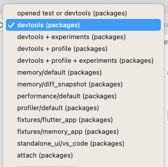
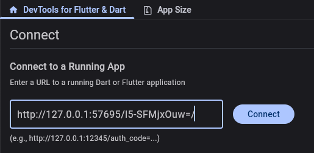

# Contributing to DevTools


_tl;dr: join [Discord](https://github.com/flutter/flutter/wiki/Chat), be
[courteous](https://github.com/flutter/flutter/blob/master/CODE_OF_CONDUCT.md), follow the steps below
to set up a development environment; if you stick around and contribute, you can
[join the team](https://github.com/flutter/flutter/wiki/Contributor-access) and get commit access._

> If you are here because you just want to test the bleeding-edge (unreleased) DevTools functionality,
follow our [beta testing guidance](https://github.com/flutter/devtools/blob/master/BETA_TESTING.md).

## Welcome

We gladly accept contributions via GitHub pull requests! We encourage you to read the
[Welcome](https://github.com/flutter/flutter/blob/master/CONTRIBUTING.md#welcome) remarks in the Flutter
framework's contributing guide, as all of that information applies to contributing to the `flutter/devtools`
repo as well.

We communicate primarily over GitHub and [Discord](https://github.com/flutter/flutter/wiki/Chat) on the
[#hackers-devtools](https://discord.com/channels/608014603317936148/1106667330093723668) channel.

Before contributing code:

1. Complete the
[Contributor License Agreement](https://cla.developers.google.com/clas).
You can do this online, and it only takes a minute.

2. Review the [DevTools style guide](STYLE.md), which uses a combination of Dart and Flutter best practices.

## Table of contents
1. [Developing for DevTools](#developing-for-devtools)
	- [Set up your DevTools environment](#set-up-your-devtools-environment)
	- [Workflow for making changes](#workflow-for-making-changes)
	- [Keeping your fork in sync](#keeping-your-fork-in-sync)
2. [Running and debugging DevTools](#running-and-debugging-devtools)
    - [Frontend only (most common)](#frontend-only-most-common)
    - [Frontend + DevTools server](#frontend--devtools-server)
    - [DevTools + VS Code integration](#devtools--vs-code-integration-ide-embedded-devtools-experience)
3. [Testing for DevTools](#testing-for-devtools)
4. [Appendix](#appendix)

## Developing for DevTools

### Set up your DevTools environment

**Before setting up your DevTools environment**, please make sure you have
[cloned the Flutter SDK from GitHub](https://docs.flutter.dev/get-started/install/macos#downloading-straight-from-github-instead-of-using-an-archive)
and added the included `flutter` and `dart` executables to your `PATH` environment variable (see Flutter
instructions for how to [update your PATH](https://docs.flutter.dev/get-started/install/macos#update-your-path)).

Typing `which flutter` and `which dart` (or `where.exe flutter` and `where.exe dart` for Windows)
into your terminal should print the path to the binaries from Flutter SDK you cloned from Github.

1. [Fork](https://docs.github.com/en/get-started/quickstart/fork-a-repo) the DevTools repo to your
own Github account, and then clone it using SSH. If you haven't already, you may need to
[generate a new SSH key](https://docs.github.com/en/github/authenticating-to-github/connecting-to-github-with-ssh)
to connect to Github with SSH.
2. Make sure to [configure Git to keep your fork in sync](https://docs.github.com/en/get-started/quickstart/fork-a-repo#configuring-git-to-sync-your-fork-with-the-upstream-repository)
with the upstream DevTools repo.
3. Ensure that you have access to the `devtools_tool` executable by adding the `tool/bin` folder to your `PATH` environment variable:
	- **MacOS Users**
		- add the following to your `~/.bashrc` file, replacing `<DEVTOOLS_DIR>` with the local path to your DevTools repo:

			```
			export PATH=$PATH:<DEVTOOLS_DIR>/tool/bin
			```
	- **Windows Users**
		- Open "Edit environment variables for your account" from Control Panel
		- Locate the `Path` variable and click **Edit**
		- Click the **New** button and paste in `<DEVTOOLS_DIR>/tool/bin`, replacing `<DEVTOOLS_DIR>`
		with the local path to your DevTools repo.
	
	Explore the commands and helpers that the `devtools_tool` provides by running `devtools_tool -h`. 
4. **Optional:** enable and activate DCM (Dart Code Metrics) - see the [DCM section below](#enable-and-activate-dcm-dart-code-metrics)

#### Set up your IDE

We recommend using VS Code for your DevTools development environment because this gives you
access to some advanced development and configuration features. When you open DevTools in VS Code,
open the `devtools/packages` directory in your VS Code workspace. This will give you access to a set
of launch configurations for running and debugging DevTools:


### Workflow for making changes

1. Change your local Flutter SDK to the latest flutter candidate branch: `devtools_tool update-flutter-sdk --from-path`
2. Create a branch from your cloned DevTools repo: `git checkout -b myBranch`
3. Ensure your branch, dependencies, and generated code are up-to-date: `devtools_tool sync`
4. Implement your changes, and commit to your branch: `git commit -m “description”`
	- If your improvement is user-facing, document it in [NEXT_RELEASE_NOTES.md](packages/devtools_app/release_notes/NEXT_RELEASE_NOTES.md)
	and include this edit as part of your PR.
5. Push to your branch to GitHub: `git push origin myBranch`
6. Navigate to the [Pull Requests](https://github.com/flutter/devtools/pulls) tab in the main
[DevTools repo](https://github.com/flutter/devtools). You should see a popup to create a pull
request from the branch in your cloned repo to the DevTools master branch. Create a pull request.
	- **Running the Dart Code Metrics Github workflow:** any PRs that change Dart code require the
	Dart Code Metrics workflow to be run before being submitted. To trigger the workflow, add the
	label `run-dcm-workflow` to your PR. If you don't have permission to add the label, your
	reviewer can add it for you.
		- Any DCM errors will be caught by the workflow. Fix them and push up your changes. To trigger
		the DCM workflow to run again, you will need to remove and then re-add the `run-dcm-workflow` label.

### Keeping your fork in-sync

- If at any time you need to re-sync your branch, run:
	```
	devtools_tool sync
	```
	This will pull the latest code from the upstream DevTools, upgrade dependencies, and perform code generation.

- If you want to upgrade dependencies and re-generate code (like mocks), but do not want to merge `upstream/master`, instead run
	```
	devtools_tool generate-code --upgrade
	```

## Running and debugging DevTools

There are a few different environments that you may need to run DevTools in. After running DevTools
in one of the environments below, connect to a test application to debug DevTools runtime tooling
(the majority of DevTools tools). See the
[Connect DevTools to a test application](#connect-devtools-to-a-test-application) section below.

### Frontend only (most common)

Most of the time, you will not need to run DevTools with the DevTools server to test your changes.
You can run DevTools in debug mode as either a Flutter web or Flutter desktop app.

> Note: though DevTools is shipped as a Flutter Web app, we recommend developing as a Flutter
Desktop app whenever possible for a more efficient development workflow. Please see the
[running on Flutter desktop](#running-devtools-on-flutter-desktop) section below for instructions.

- To run DevTools as a Flutter web app **from VS Code**, run with the **devtools (packages)** configuration and the "Chrome" device
	- To run with experiments enabled, run from VS Code with the **devtools + experiments (packages)** configuration
- To run DevTools as a Flutter web app **from the command line**, run `flutter run -d chrome`
	- To run with experiments enabled, add the flag `--dart-define=enable_experiments=true`

### Frontend + DevTools server

To develop with a workflow that exercises the DevTools server <==> DevTools client connection,
you will need to perform the following set up steps (first time only).

1. Clone the [Dart SDK](https://github.com/dart-lang/sdk) fron GitHub.
2. The `LOCAL_DART_SDK` environment variable needs to point to this path: `export LOCAL_DART_SDK=/path/to/dart/sdk`

If you are also developing server side code (e.g. the `devtools_shared` package), you will need to add a
dependency override to `sdk/pkg/dds/pubspec.yaml`.

```yaml
dependency_overrides:
  devtools_shared:
    path: relative/path/to/devtools/packages/devtools_shared
```

Then you can run DevTools with the server by running the following from the top-level `devtools` directory:
```
devtools_tool serve
```

### DevTools + VS Code integration (IDE-embedded DevTools experience)

To test the integration with VS Code, you can set up the Dart VS Code extension to run DevTools
and the server from your local source code. Follow the
[Frontend + DevTools server](#frontend--devtools-server) setup instructions above, and make sure
you have version v3.47 or newer of the Dart extension for VS Code.

Open your VS Code settings (Run the **Preferences: Open User Settings (JSON)** command from the
command palette (`F1`)) and add the following to your settings:

```js
"dart.customDevTools": {
	"path": "/path/to/devtools",
	"env": {
		"LOCAL_DART_SDK": "/path/to/dart-sdk/sdk"
		// Path to the version that Flutter DevTools is pinned to.
        "FLUTTER_ROOT": "/path/to/devtools/tool/flutter-sdk"
	}
},
```

This instructs VS Code to run the `devtools_tool serve` command instead of running `dart devtools`.
You must set the `LOCAL_DART_SDK` and `FLUTTER_ROOT` env variables correctly for the script to work.

Next, restart VS Code (or run the **Developer: Reload Window** command from the command palette (`F1`))
and DevTools will be run from your local source code. After making any code changes to DevTools or the
server, you will need to re-run the **Developer: Reload Window** command to rebuild and restart the server.

## Testing for DevTools

Please see [TESTING.md](TESTING.md) for guidance on running and writing tests.

## Appendix

### Connect DevTools to a test application

For working on most DevTools tools, a connection to a running Dart or Flutter app is required. Run any Dart of Flutter app of your choice to
connect it to DevTools. Consider running the [Flutter gallery](https://github.com/flutter/gallery#running) app, as it has plenty of interesting
code to debug.
1. Run your Dart or Flutter app
	> Note: some DevTools features may be unavailable depending on the test app platform (Flutter native, Flutter web, Dart CLI, etc.) or run mode
	(debug, profile) you choose.
2. Copy the URI printed to the command line (you will use this uri to connect to DevTools) 

	```
	"A Dart VM Service on iPhone 14 Pro Max is available at: <copy-this-uri>"
	```
3. Paste this URI into the connect dialog in DevTools and click "Connect"

	

### Running DevTools on Flutter Desktop

For a faster development cycle with hot reload, you can run DevTools on Flutter desktop. Some DevTools
features only work on the web, like the embedded Perfetto trace viewer, DevTools extensions, or DevTools
analytics, but the limitations on the desktop app are few.

To run DevTools with the desktop embedder, you can run with either of the following from `devtools/packages/devtools_app`:

- `flutter run -d macos`
- `flutter run -d linux`

If this fails, you may need to run `flutter create .` from `devtools/packages/devtools_app` to generate
the updated files for your platform. If you want to run DevTools on Flutter desktop for Windows, you will
need to generate the files for this platform using the same command, and then run using `flutter run -d windows`.

### Enable and activate DCM (Dart Code Metrics)

Enabling and activating DCM is optional. When you open a PR, the CI bots will show you any DCM warnings introduced
by your change which should be fixed before submitting.

- **Contributors who work at Google:** you can use the Google-purchased license key to activate DCM.
See [go/dash-devexp-dcm-keys](http://goto.google.com/dash-devexp-dcm-keys).

- **All other contributors:** please follow instructions at <https://dcm.dev/pricing/>. You can either use the free tier of DCM, or purchase a team license. Note that the free tier doesn't support all the rules of the paid tier, so you will also need to consult the output of the [Dart Code Metrics workflow on Github](#running-the-dart-code-metrics-github-workflow) when you open your PR.

To enable DCM:

1. Install the executable for your target platform. You can refer to [this guide](https://dcm.dev/docs/teams/getting-started/#installation).
2. [Get the license key](http://goto.google.com/dash-devexp-dcm-keys) and activate DCM. To do so, run `dcm activate --license-key=YOUR_KEY` from the console.
3. Install the extension for your IDE. If you use VS Code, you can get it from [the marketplace](https://marketplace.visualstudio.com/items?itemName=dcmdev.dcm-vscode-extension). If you use IntelliJ IDEA or Android Studio, you can find the plugin [here](https://plugins.jetbrains.com/plugin/20856-dcm).
4. Reload the IDE.

>Note:  DCM issues can be distinguished from the Dart analyzer issues by their name: DCM rule names contain `-`. Some of the issues can be fixed via CLI, to do so, run `dcm fix` for any directory. To apply `dcm fix` on a file save in the IDE, refer to [this guide](https://dcm.dev/docs/teams/ide-integrations/vscode/#extension-capabilities).

### third_party dependencies

All content not authored by the Flutter team (which includes both sponsored and open-source contributors)
must go in the `third_party` directory. As an expedient to make the `third_party` code work well with our
build scripts, code in `third_party` should be given a stub `pubspec.yaml` file so that you can reference
the resources from the packages directory from `packages/devtools_app/web/index.html`