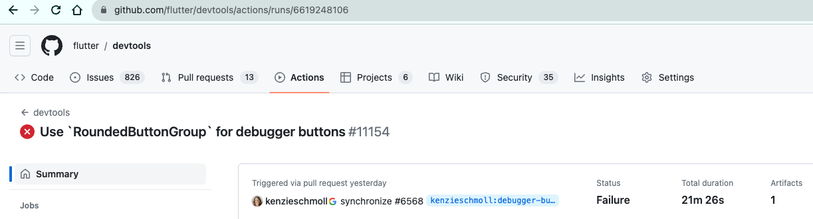
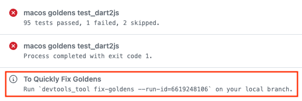

Testing for DevTools
=======================

DevTools is test covered by multiple types of tests, all of which are run on the CI for each DevTools PR / commit:

1. Unit tests
    - tests for business logic
2. Widget tests
    - tests for DevTools UI components using mock or fake data
    - some widget tests may contain golden image testing
3. Partial integration tests
    - tests for DevTools UI and business logic with a real VM service connection to a test app
4. Full integration tests
    - Flutter web integration tests that run DevTools as a Flutter web app and connect it to a real test app
    on multiple platforms (Flutter mobile, Flutter web, and Dart CLI)

**The following instructions are for unit tests, widget tests, and partial integration tests** in DevTools. For instructions
on running and writing full integration tests, please see [integration_test/README.md](integration_test/README.md).
In general, we should first try to test cover new features and bug fixes with unit tests or widget tests
before writing new integration tests, which are slower to run and are not as easy to debug or iterate upon.

## Running DevTools tests

Before running tests, make sure your Flutter SDK matches the version that will be used on
the CI. To update your local flutter version, run:

```
./tool/update_flutter_sdk.sh --local
```
> Note: Running this command requires that you have followed the [set up instructions](CONTRIBUTING.md#set-up-your-devtools-environment)
in the DevTools contributing guide regarding cloning the Flutter SDK from GitHub.

Now you can proceed with running DevTools tests:

```
cd packages/devtools_app
flutter test test/
```

### Updating golden image files

> Note: golden images should only be generated on MacOS.

Golden image tests will fail for one of three reasons:

1. The UI has been _intentionally_ modified.
2. Something changed in the Flutter framework that would cause downstream changes for our tests.
3. The UI has been _unintentionally_ modified, in which case we should not accept the changes.

For valid golden image updates (1 and 2 above), the failing golden images will need to be updated. This can
be done in one of two ways:

1. If the tests failed on the CI for a PR, we can download the generated golden images directly from GitHub.
    > If you are developing on a non-MacOS machine, this is the only way you'll be able to update the golden images. 
    - Natvigate to the failed Actions run for your PR on GitHub. Example:

        
    
    - Scroll to the bottom of the Summary view to see the errors from the `macos goldens` job, and the notice containing the golden update command:

        

2. Update the goldens locally by running the failing test(s) with the `--update-goldens` flag.

    - Before updating the goldens, ensure your version of Flutter matches the version of Flutter that is used
    on the CI. To update your local flutter version, run:

        ```
        ./tool/update_flutter_sdk.sh --local
        ```

    - Then proceed with updating the goldens:

        ```
        flutter test <path/to/my/test> --update-goldens
        ```

        or to update goldens for all tests:
        ```
        flutter test test/ --update-goldens
        ```

## Writing DevTools tests

When you add a new feature or fix a bug, please add a corresponding test for your change.

- If there is an existing test file for the feature your code touches, you can add the test case
there. 
- Otherwise, create a new test file with the `_test.dart` suffix, and place it in an appropriate
location under the `test/` directory for the DevTools package you are working on.

