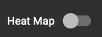
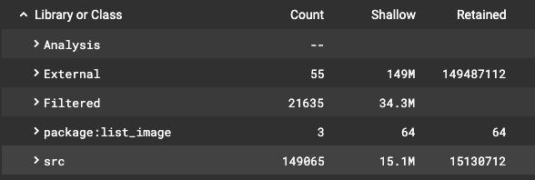
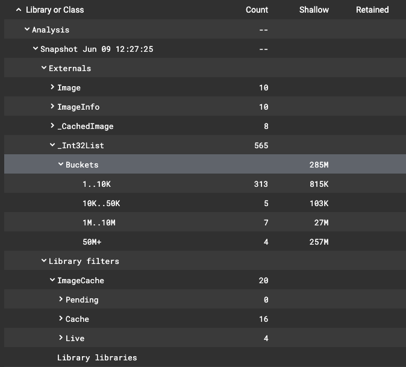
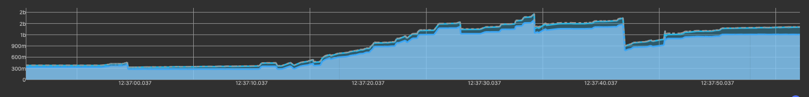
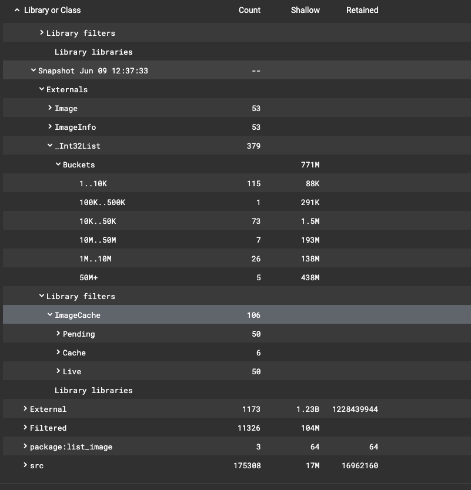
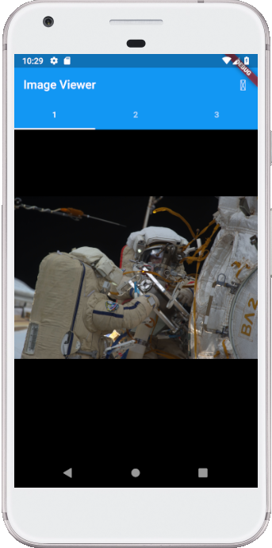

# Download and render network images.

A material design widget to view downloaded network images.

**Warning:** This is a case study that will eventually crash running out of memory.

**Using DevTools**

```cd case_study/memory_leaks/images_1
flutter pub get
flutter run
```

Open DevTools and copy paste URL displayed on this line e.g.,

```An Observatory debugger and profiler on AOSP on IA Emulator is available at: http://127.0.0.1:43473/5IvsZcde53E=/```

After DevTools has connected to this running Flutter application, click on the Memory tab.

Click on the leaky Image Viewer app (the image) and drag down for a few images to load.  Memory profile should be display:


Press the Snapshot button to collect all the information of all objects in the Dart VM Heap.


When complete a Heat Map will appear.

Turn off the Heat Map swtich:



When the Heat Map is switched off a table view is displayed of all objects in the Dart VM heap.



Press the Analyze button to analyze the current Snapshot


After the snashot analysis a child row inside of > Analysis will be added titled "Snapshot ..." with the timetime stamp of the snapshot e.g., "Snapshot Jun 09 12:23:44".



The analysis has checked on raw memory objects that contain the images, any classes concerning images in Flutter under the > Externals entry.

In particular expand the

```> Snapshot MMM DD HH:MM:SS
     > Externals
       > _Int32List
         > Buckets```
       
You'll notice a number of chunks of _Int32List memory is displayed into their corresponding bucket sizes.  The images are in the 1M..10M and 50M+ buckets.  Eleven images total ~284M.

The next interesting piece of information is to expand:

```> Snapshot MMM DD HH:MM:SS
     > Library filters
       > ImageCache
```

This will display the number objects in the ImageCache for pending, cache and live images.

Now start traversing through the images in the "Image Viewer" scroll down a lot noticing how the memory is growing rapidly 500M, 900M, 1b, and topping 2b in total memory usage.



As the graph grows press "Snapshot" and then "Analyze" the snapshot analysis should appear:



Notice as you expand the _Int32List under Externals that the size has now grown to 771M.

```193M for seven images in the 10M..50M range.
138M for 26 images in the 1M..10M range.
438M for 5 images in the 50M+ range.
```

**Solution:** Fix the ListView.builder add the parameters cacheHeight and cacheWidth to the Image.network constructor e.g.,

Look for:
```dart
Widget listView() => ListView.builder
```
Find the Image.network constructor then add the below parameters:
```dart
// Decode image to a specified height and width (ResizeImage).
cacheHeight: 1024,
cacheWidth: 1024,
```
Original code:
```dart
final image = Image.network(
  imgUrl,
  width: 750.0,
  height: 500,
  scale: 1.0,
  fit: BoxFit.fitWidth,
  loadingBuilder: (
    BuildContext context,
    Widget child,
    ImageChunkEvent loadingProgress,
  ) {
    if (loadingProgress == null) return child;
    return recordLoadedImage(loadingProgress, imgUrl);
  },
);
```
Fixed code:
```dart
final image = Image.network(
  imgUrl,
  width: 750.0,
  height: 500,
  scale: 1.0,
  // Decode image to a specified height and width (ResizeImage).
  cacheHeight: 1024,
  cacheWidth: 1024,
  fit: BoxFit.fitWidth,
  loadingBuilder: (
    BuildContext context,
    Widget child,
    ImageChunkEvent loadingProgress,
  ) {
    if (loadingProgress == null) return child;
    return recordLoadedImage(loadingProgress, imgUrl);
  },
);
```

The parameters cacheWidth or cacheHeight indicates to the engine that the image should be decoded at the specified size e.g., thumbnail. If not specified the full image will be used each time when all that is needed is a much smaller image.  The image will be rendered to the constraints of the layout or width and height regardless of these parameters. These parameters are intended to reduce the memory usage of ImageCache

Read [[Image.network Documentation](https://api.flutter.dev/flutter/widgets/Image/Image.network.html)].



## Getting Started

For help getting started with Flutter, view online [documentation](http://flutter.io/).
