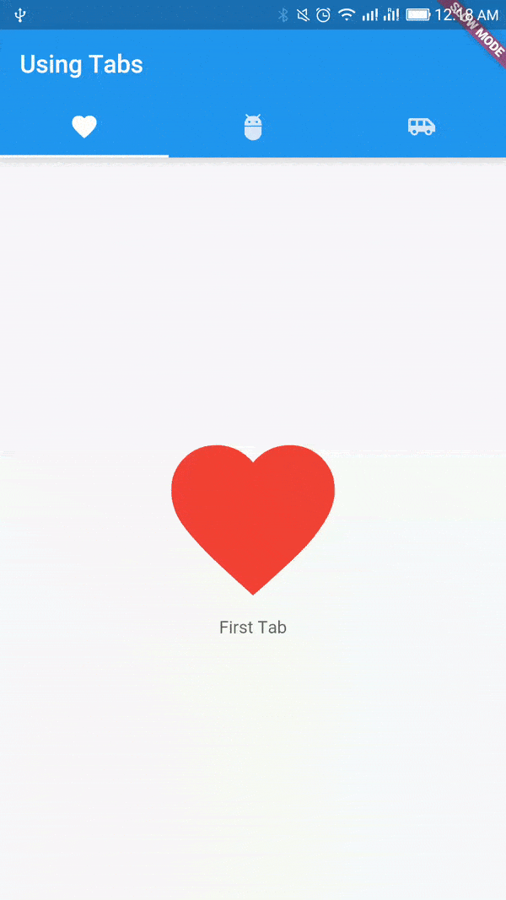

# Using Tab Bar

A material design widget that displays a horizontal row of tabs.

Read ([Documentation](https://api.flutter.dev/flutter/material/TabBar-class.html)) ([Material Design Spec](https://m2.material.io/components/tabs))

