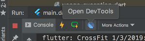

## Installing the Flutter plugin

Install the Flutter plugin if you don't already have it installed. This can be done
via the normal `Plugins` page in the IntelliJ and Android Studio settings. Once that
page is open, you can search the marketplace for the Flutter plugin.

## Running an app

In order to open DevTools, you typically first want to run a Flutter app. This
can be accomplished by opening a Flutter project, ensuring you have a device connected,
and hitting the `Run` or `Debug` toolbar buttons.

Once an app is running, you can start DevTools by:

- clicking on the `Open DevTools` toolbar action in the Run view
- clicking on the `Open DevTools` toolbar action in the Debug view (if debugging)
- selecting the `Open DevTools` action from the `More Actions` menu in the
  Flutter Inspector view

## As an action

You can also open DevTools from an IntelliJ action. Open the `Find Action...`
dialog (on a Mac, type `cmd-shift-a`), and search for the `Open DevTools` action.
When you select that action, DevTools will be installed, the DevTools server
launched, and a browser instance will open pointing to the DevTools app.

When opened via an IntelliJ action, the app will not be connected to a Flutter app.
You'll need to provide it with a service protocol port for a currently running app;
this can be done via the in-line `Connect to a running app` dialog.
