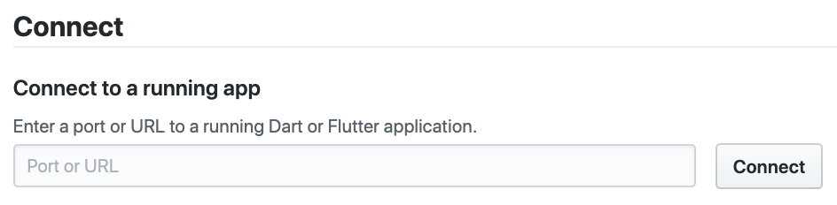

* toc
{:toc}

## Installing DevTools

If you have `pub` on your path, you can run:

- `pub global activate devtools`

If you have `flutter` on your path, you can run:

- `flutter pub global activate devtools`

That will install (or update) DevTools on your machine.

## Run the DevTools application server

Next, run the local web server, which serves the DevTools application itself.
To do that, run one of the following two commands:

- `pub global run devtools` (if you have `pub` on your path)

- `flutter pub global run devtools` (if you have `flutter` on your path)

On the command-line, you should see output that looks something like:

> Serving DevTools at `http://127.0.0.1:9100`

## Start an application to debug

Next, start an app to connect to. This can be either a Flutter application or a Dart
command-line application. The example below uses a Flutter app:

- `cd path/to/flutter/app`
- `flutter run`

You'll need to have a device connected - or a simulator open - for `flutter run` to work.
Once the app starts, you'll see a message in your terminal that looks like:

> An Observatory debugger and profiler on iPhone X is available at: `http://127.0.0.1:50976/Swm0bjIe0ks=/`

Keep note of this uri, as you will use it to connect your app to DevTools.

## Opening DevTools and connecting to the target app

Using DevTools now is as simple as opening a Chrome browser window to `http://localhost:9100`.
Once DevTools opens, you will see a connect dialog:

Paste the uri you got from running your app (in this example, `http://127.0.0.1:50976/Swm0bjIe0ks=/`)
into the connect dialog to connect your app to DevTools.

This uri contains a security token, so the uri will be different for each run of your app.
This means that if you stop your application and re-run it, you will need to connect to DevTools
with the new uri.
