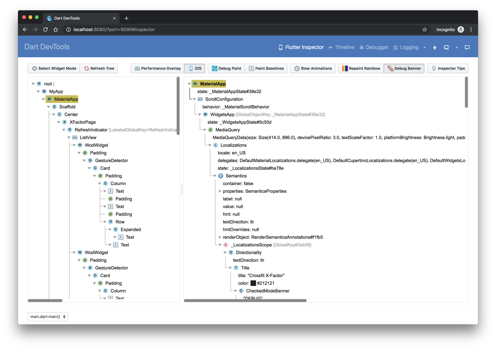
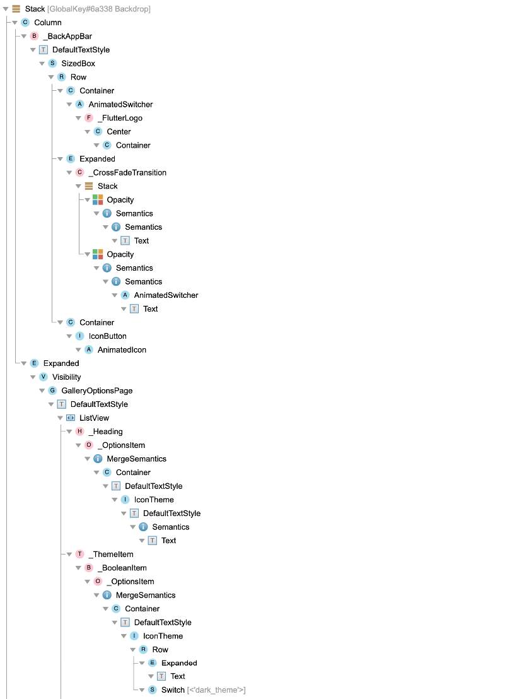
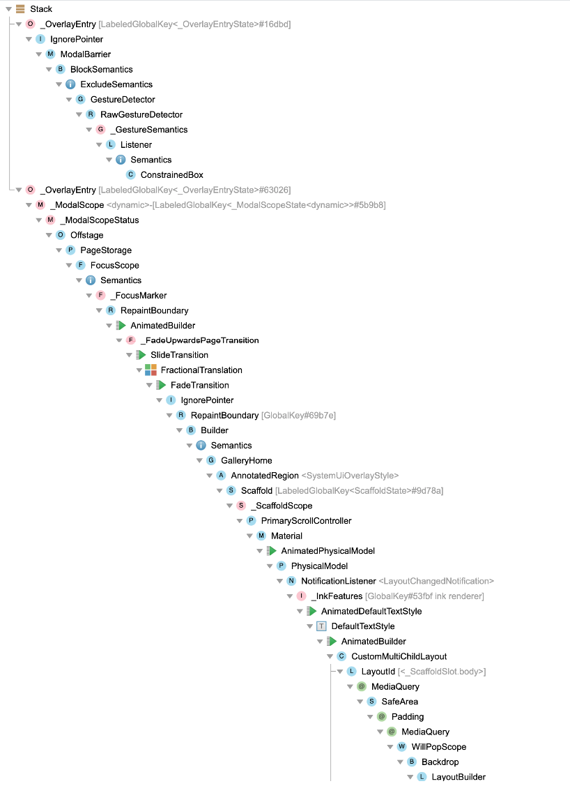

* toc
{:toc}

## What is it?

The Flutter widget inspector is powerful tool for visualizing and exploring
Flutter widget trees. The Flutter framework uses widgets as
[the core building block](https://flutter.dev/docs/development/ui/widgets-intro)
for anything from controls (text, buttons, toggles, etc.) to layout (centering,
padding, rows, columns, etc.). The inspector is powerful tool for visualizing and
exploring Flutter these widget trees, and can be useful for:

* understanding existing layouts
* diagnosing layout issues



## Getting started

To start click the `Flutter Inspector` tab on the DevTools toolbar.

You can browse around the interactive widget tree in DevTools to view
nearby widgets and see their field values.

To locate individual UI elements in the widget tree, hit the `Select Widget Mode`
button in the toolbar. This will change the app on the device into a 'widget select'
mode. Click on any widget in the app's UI; that will select the widget on the screen
and scroll the widget tree to the corresponding node. Toggle the `Select Widget Mode`
button again in order to exit the widget select mode.

When debugging layout issues, the key fields to look at are the `size` and
`constraints` fields. The constraints flow down the tree, and the sizes flow back up.

## DartConf 2018 inspector talk

For a demonstration of what's generally possible with the inspector, see the
[DartConf 2018 talk](https://www.youtube.com/watch?v=JIcmJNT9DNI), demonstrating
the IntelliJ version of the Flutter inspector.

## Track widget creation

Part of the functionality of the Flutter inspector is based on instrumenting the
application code in order to better understand the source locations where widgets are
created. The source instrumentation allows the Flutter inspector to present the widget
tree in a manner similar to how the UI was defined in your source code. Without it,
the tree of nodes in the widget tree are much deeper, and it can be more difficult to
understand how the runtime widget hierarchy corresponds to your application's UI.

When an application is launched from IDEs, the source instrumentation happens
by default. For command line launches, you need to opt-into the source instrumentation.
To do this, run Flutter app's with the `--track-widget-creation` flag:

```
flutter run --track-widget-creation
```

If you launch without the flag, you can still use the inspector; you'll see an in-line,
dismissible reminder message about using the source instrumentation flag.

Here is an example of what your widget tree may look like with and without track widget
creation enabled.

Track widget creation enabled (recommended):


Track widget creation disabled (not recommended):

