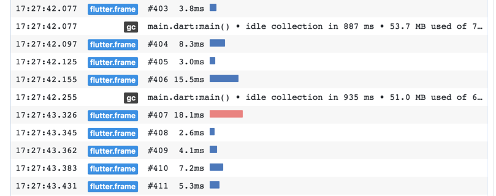

* toc
{:toc}

## What is it?

The logging view displays events from the Dart runtime, application frameworks (like
Flutter), and application-level logging events.

## Standard logging events

By default the logging view shows:

- garbage collect events from the Dart runtime
- Flutter framework events, like frame creation events
- stdout and stderr from applications
- custom logging events from applications



## Logging from your application

You have two options for logging from your application. The first is to just use stdout
and stderr. Generally, this is done by using `print` statements, or by importing `dart:io`
and invoking methods on `stderr` or `stdout`:

```dart
stderr.writeln('print me');
```

The other option for application logging is to use the  `dart:developer`
[log](https://api.dartlang.org/stable/2.1.1/dart-developer/log.html) method.
This allows you to include a bit more granularity and information in the logging
output. Here's an example:

```dart
import 'dart:developer' as developer;

void main() {
  developer.log('log me', name: 'my.app.category');

  developer.log('log me 1', name: 'my.other.category');
  developer.log('log me 2', name: 'my.other.category');
}
```

You can also pass application data to the log call. The convention for this is to
use the `error:` named parameter on the `log()` call, JSON encode the object you want
to send, and pass the encoded string to the error parameter.

```dart
import 'dart:convert';
import 'dart:developer' as developer;

void main() {
  var myCustomObject = ...;

  developer.log(
    'log me',
    name: 'my.app.category',
    error: jsonEncode(myCustomObject),
  );
}
```

The logging view will interpret the JSON encoded error param as a data object and
render it in the details view for that log entry.

## Showing network traffic

There is a preview version of a package that you can use to show your application's
network traffic in the logging view. To use it, create a pubspec dependency on the
`logs` package:

```yaml
dependencies:
  logs:
    git: https://github.com/pq/logs
```

and, in your application code:

```dart
import 'package:logs/logs.dart';

final Log httpLog = new Log('http');

void main() {
  httpLog.enabled = true;
  ...

```

Once http logging is enabled, you should see http calls (those that ultimately go through
`dart:io`'s `HttpClient` class) logged to the logging view.

## Clearing logs

To clear the log entries in the logging view, hit the `Clear logs` button.
