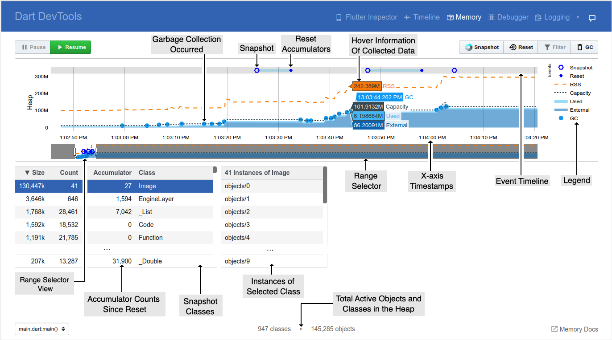
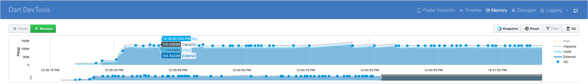
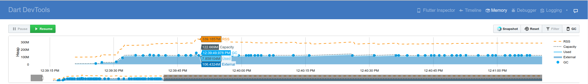
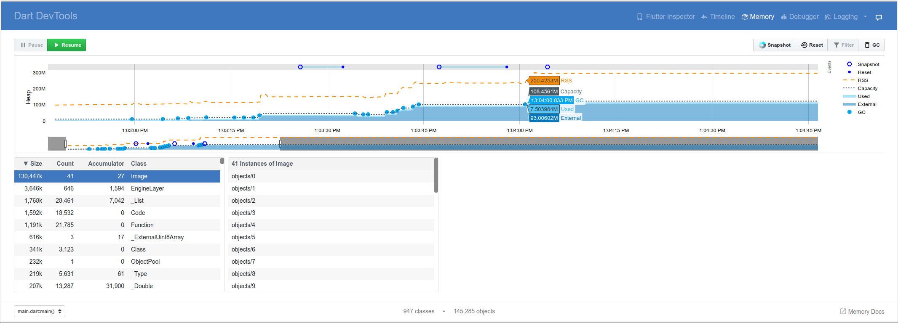

* toc
{:toc}

## What is it?

Allocated Dart objects created using a class constructor see [Dart Using constructors](https://www.dartlang.org/guides/language/language-tour#using-constructors) e.g.,
```dart
new MyClass()
```
or
```dart
MyClass()
```
, live in a portion of memory called the heap.

DevTools Memory tab lets you peek at how an isolate is using memory at a given moment. This pane, using Snapshot and Reset, can display accumulator counts. The accumulators can be used to study the rate of memory allocations, if you suspect your application is leaking memory or has other bugs relating to memory allocation.

Memory profiling consists of four parts, each increasing in granularity:
- Memory Overview Chart
- Event Timeline
- Snapshot Classes
- Class Instances

**Use a profile build of your application to analyze performance.** Memory usage is not indicative of release performance unless your application is run in profile mode. In general, memory usage is fairly accurate in relative terms between debug, release or profile mode. However, the absolute memory used maybe higher in debug versus release builds. In a release build work can be computed and optimized ahead of time.  However, in a debug build that same work may have to be computed at runtime. 

## Memory Overview Chart

Is a timeseries graph to visualize the state of the Flutter memory at successive intervals of time. Each data point on
the chart corresponds to the timestamp (x-axis) of measured quantities (y-axis) of the heap e.g., usage, capacity, external,
garbage collection and Resident Set Size.



- Legend - All collected measurements regarding the memory. Clicking on a legend name will hide or show that data.
- Range Selector - All memory data collected (timeseries).  The left-most or first time/data (memory information) in the selector is when the application was launched. The right-most or last time/data is the continual memory information being received (live) until the application is stopped.
- Range Selector View - Detailed view of the data collected for this timeseries range (non-gray area).
- X-axis Timestamps - Time of the collected memory information (capacity, used, external, RSS, and GC)
- Hover Information of Collected Data - At a particular time (x-axis) the detailed collected memory data.
- [Garbage Collection](#glossary-of-vm-terms) Occurred - Compaction of the heap occurred.
- Event Timeline - When a user action occurred (e.g., "Snapshot" or "Reset" button clicked see upper right buttons).
- Snapshot - Display a table of current active memory objects (see Snapshot Classes).
- Reset Accumulators - Reset values, to zero, under the column “Accumulator” in the Snapshot Classes table.
- Filtering Classes - **_TODO: Document Filter dialog_**
- Snapshot Classes - Clicking on the Snapshot button (top right area) will display a table of current memory objects. The memory objects can be sorted by class name, size, allocated instances, etc.
- Accumulator Counts Since Reset - Clicking on the Reset button (top right area) will reset the accumulated instances count. Clicking on Snapshot after a reset will display the number of new instances allocated since last reset. This is useful for finding memory leaks.
- Class Instances - Clicking on a class in the Snapshot Classes table will display the number of active instances for that class.
- Inspecting Contents of an Instance - **_TODO: Document inspecting data values of an instance._**
- Total Active Objects and Classes in the Heap - Total Classes allocated in the Heap and Total Objects (instances) in the Heap.

## Memory Overview Chart



This chart is a timeseries graph to help visualize the state of the heap at various points in time.

The chart's x-axis is a timeline of events (timeseries) In other words, it shows the polled state of the memory
every 500 ms. This helps to give a live appearance on the state of the memory as the application is running. The quantities plotted on the
y-axis are (from top to bottom):
- Capacity - Current capacity of the heap.
- GC - GC has occurred.
- Used - Objects (Dart objects) in the the heap.
- External - memory that is not in the Dart heap but is still retained (e.g., memory read from a file or a decoded image in Flutter).



To view RSS (Resident Set Size), click on the name RSS located in the legend.

- The Resident Set Size displays the amount of memory allocated to a process. It does not include memory that is swapped out. It includes memory from shared libraries, that are loaded, as well as all stack and heap memory.

See [Dart VM Internals](https://mrale.ph/dartvm/) for more information.

## Event Timeline


This chart displays DevTools events (e.g., Snapshot and Reset button clicks) in relation to the memory chart timeline. Hovering over the markers in the Event Timeline will display the time when the event occurred. This helps identify when a memory leak might have occurred in the timeline (x-axis).

Clicking on the Snapshot button will show the current state of the heap with regard to all active classes and their instances. When the Reset button is pressed, the accumulator for all classes is reset to zero. The reset is temporally tied,  using a faint blue horizontal bar,  to the previous Snapshot. Clicking on the Reset button, again, will reset the accumulators since the last Reset and temporally tie the latest reset to the previous reset.

## Snapshot Classes
Classes allocated in the heap, total instances, total bytes allocated, and an accumulator of allocations since the last reset

- Size - Total amount of memory used by current objects in the heap.
- Count - Total number of current objects in the heap.
- Accumulator - Total number of objects in the heap since the last reset.
- Class - An aggregate of the objects allocated to this class. Clicking on a class displays a list of class instances.

## Class Instances
Displays a list of class instances by their handle name. **_TODO: Add link to inspecting data values_**.

## Memory Actions

### Liveness of the Memory Overview Chart
- Pause - Pause the memory overview chart to allow inspecting the currently plotted data. Incoming memory data is still received; notice the Range Selector continues to grow to the right.
- Resume - The memroy overview chart is live and displaying the current time and the latest memory data received.

### Managing the Objects and Statistics in the Heap
- Snapshot - Returns the list of active classes in the heap. The Accumulator column displays the number of allocated objects since the previous "Reset".
- Reset - Zeroes out the Accumulator column in the Snapshot Classes table and refreshes the displayed data.
- Filter - The Snapshot Classes table displays classes from the set of packages selected.
- GC - Initiates a garbage collection.

## Glossary of VM Terms
Here are some computer science concepts that will help you better understand how your application uses memory.
- Garbage collection (GC) - GC is the process of searching the heap to locate, and reclaim, regions of “dead” memory—memory that is no longer being used by an application. This process allows the memory to be re-used and minimizes the risk of an application running out of memory, causing it to crash. Garbage collection is performed automatically by the Dart VM. In DevTool, you can perform garbage collection on demand by clicking the GC button.
- Heap - Dart objects that are dynamically allocated live in a portion of memory called the heap. An object allocated from the heap is freed (eligible for garbage collection) when nothing points to it, or when the application terminates. When nothing points to an object, it is considered to be dead. When an object is pointed to by another object, it is live.
- Isolates - Dart supports concurrent execution by way of isolates, which you can think of as processes without the overhead. Each isolate has its own memory and code, which can’t be affected by any other isolate. For more information, see [The Event Loop and Dart](https://webdev.dartlang.org/articles/performance/event-loop).
- Memory leak - A memory leak occurs when an object is live (meaning that another object points to it) but it is not being used (so it shouldn’t have any references from other objects). Such an object can’t be garbage collected, so it takes up space in the heap and contributes to memory fragmentation. Memory leaks put unnecessary pressure on the VM and can be difficult to debug.
- Virtual machine (VM) - The Dart virtual machine is a piece of software that directly executes Dart code.