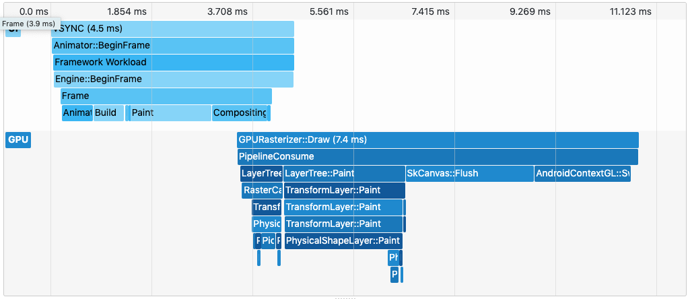
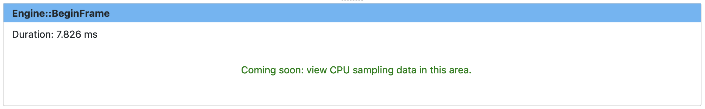

* toc
{:toc}

## What is it?
The timeline view displays information about Flutter frames. It consists of
 three parts, each increasing in granularity:
- Frame Rendering Chart
- Flame Chart
- Event Details

**Use a profile build of your application to analyze performance.** Frame rendering times are not indicative of release
performance unless your application is run in profile mode.

## Frame Rendering Chart
This chart is populated with individual frames as they are rendered in your application. Each bar in the chart
represents a frame. The bars are color-coded to highlight the different portions of work that occur when rendering a
Flutter frame:
- CPU: Dart code running from your application as well as the the Flutter framework
- GPU: graphics code running from the Flutter Engine

Clicking a bar will display additional details about the frame.

### Jank
The frame rendering chart shows CPU and GPU jank in shades of red. We consider a portion of the frame to be janky when
it takes more than 8 ms to complete.

To achieve a frame rendering rate of 60 FPS (frames per second), each frame must render in ~16 ms or less. Since there
are two portions of work for each frame (CPU and GPU), each portion should complete in 8 ms or less. When this target is
missed, you may experience UI jank or dropped frames.

## Flame Chart
The flame chart shows the event trace for a single frame. The top-most event spawns the event below it, and so on and so
forth. The CPU and GPU events are separate event flows, but they share a common timeline (displayed at the top of the
flame chart). This timeline is strictly for the given frame. It does not reflect the clock shared by all frames.

The flame chart supports zooming and panning. Scroll up and down to zoom in and out, respectively. To pan around, you
can either click and drag the chart or scroll horizontally. You can also click an event to view more details in the
details section below the chart.

## Event Details
This section shows details for a specific event. Currently, only the event name and duration are displayed. This feature
is actively being worked on. We are planning to display CPU sampling data here in the future.

