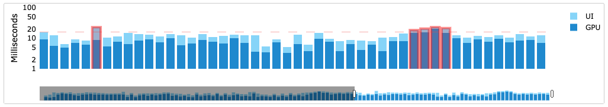
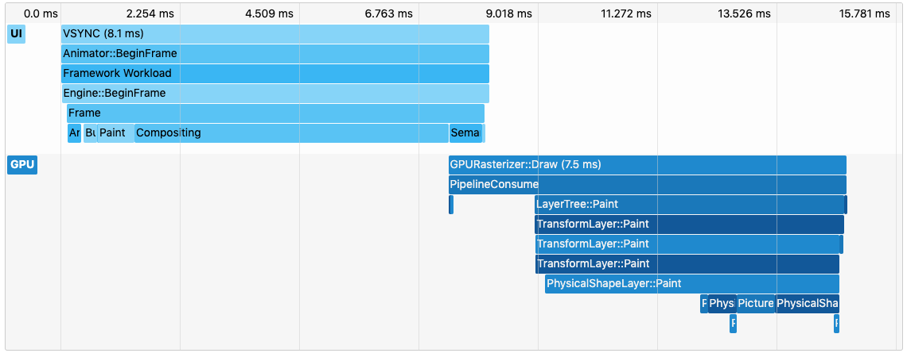
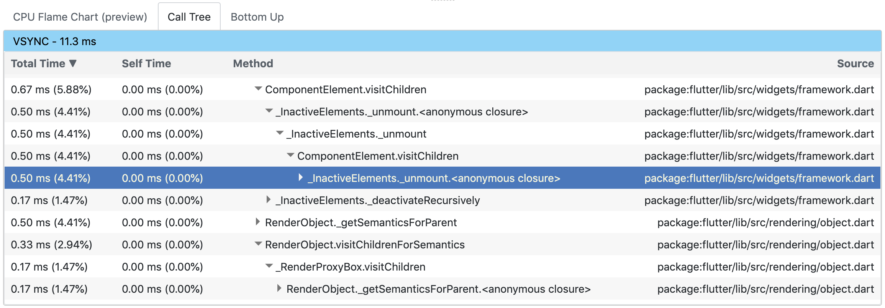
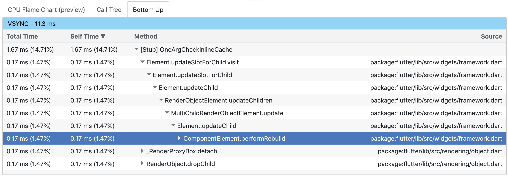

* toc
{:toc}

## What is it?

The timeline view displays information about Flutter frames. It consists of
 three parts, each increasing in granularity:
- Frame Rendering Chart
- Frame Events Chart
- CPU Profiler

**Use a profile build of your application to analyze performance.** Frame rendering times are not indicative of release
performance unless your application is run in profile mode.

The timeline view also supports import and export. See the [Import and Export](#import-and-export) section below for
details.

## Frame Rendering Chart

This chart is populated with individual frames as they are rendered in your application. Each bar in the chart
represents a frame. The bars are color-coded to highlight the different portions of work that occur when rendering a
Flutter frame: work from the UI thread and work from the GPU thread.

Clicking a bar will display additional details about the frame.

### UI

The UI thread executes Dart code in the Dart VM. This includes code from your application as well as the
Flutter framework. When your app creates and displays a scene, the UI thread creates a layer tree, a lightweight object
containing device-agnostic painting commands, and sends the layer tree to the GPU thread to be rendered on the device.
Do **not** block this thread.

### GPU

The GPU thread executes graphics code from the Flutter Engine. This thread takes the layer tree and displays it by
talking to the GPU (graphic processing unit). You cannot directly access the GPU thread or its data, but if this thread
is slow, it’s a result of something you’ve done in the Dart code. Skia, the graphics library, runs on this thread, which
is sometimes called the rasterizer thread.

Sometimes a scene results in a layer tree that is easy to construct, but expensive to render on the GPU thread. In this
case, you’ll need to figure out what your code is doing that is causing rendering code to be slow. Specific kinds of
workloads are more difficult for the GPU. They may involve unnecessary calls to
[saveLayer](https://docs.flutter.io/flutter/dart-ui/Canvas/saveLayer.html), intersecting opacities with multiple
objects, and clips or shadows in specific situations.

More information on profiling the GPU thread can be found at
[flutter.dev](https://flutter.dev/docs/testing/ui-performance#identifying-problems-in-the-gpu-graph).

### Jank

The frame rendering chart shows jank with a red overlay. We consider a frame to be janky if it takes more than ~16 ms to
complete. To achieve a frame rendering rate of 60 FPS (frames per second), each frame must render in ~16 ms or less.
When this target is missed, you may experience UI jank or dropped frames.

See [Flutter performance profiling](https://flutter.dev/docs/testing/ui-performance) for more detailed information on
how to analyze your app's performance.

## Frame Events Chart

The frame events chart shows the event trace for a single frame. The top-most event spawns the event below it, and so on
and so forth. The UI and GPU events are separate event flows, but they share a common timeline (displayed at the top of
the flame chart). This timeline is strictly for the given frame. It does not reflect the clock shared by all frames.

The flame chart supports zooming and panning. Scroll up and down to zoom in and out, respectively. To pan around, you
can either click and drag the chart or scroll horizontally. You can click an event to view CPU profiling information
in the CPU profiler below this section.

## CPU Profiler

This section shows CPU profiling information for a specific event from the frame events chart (Build, Layout, Paint, etc.).

### CPU Flame Chart

This tab of the profiler shows CPU samples for the selected frame event (e.g. Layout in the example below). This chart
should be viewed as a top-down stack trace, where the top-most stack frame calls the one below it. The width of each
stack frame represents the amount of time it consumed the CPU. Stack frames that consume a lot of CPU time may be a good
place to look for possible performance improvements.

### Call Tree

The call tree view shows the method trace for the CPU profile. This table is a top-down representation of the profile,
meaning a method can be expanded to show its _callees_.
- **Total Time**: time the method spent executing its own code as well as the code for its callees
- **Self Time**: time the method spent executing only its own code
- **Method**: name of the called method
- **Source**: file path for the method call site

### Bottom Up

The bottom up view shows the method trace for the CPU profile, but as the name suggests, it is a bottom-up
representation of the profile. This means each top level method in the table is actually the last method in the call
stack for a given CPU sample (i.e. it is the leaf node for the sample). In this table, a method can be expanded to show
its _callers_.
- **Total Time**: time the method spent executing its own code as well as the code for its callee
- **Self Time**: for top level methods in the bottom up tree (leaf stack frames in the profile), this is the time the 
method spent executing only its own code; for sub nodes (the callers in the CPU profile), this
is the self time of the callee when being called by the caller. Using the example below, the self time of the caller
`Element.updateSlotForChild.visit` is equal to the self time of the callee `[Stub] OneArgCheckInlineCache` when being
 called by the caller.
- **Method**: name of the called method
- **Source**: file path for the method call site

## Import and Export

DevTools supports importing and exporting timeline snapshots. Clicking the export button (upper-right corner above the
frame rendering chart) will download a snapshot of the current timeline state. To import a timeline snapshot, you can
drag and drop the snapshot into DevTools from any page. **Note that DevTools only supports importing files that were
originally exported from DevTools.**
