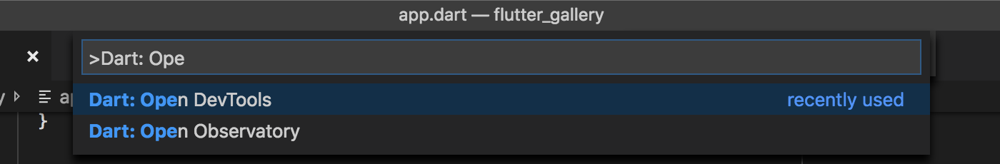
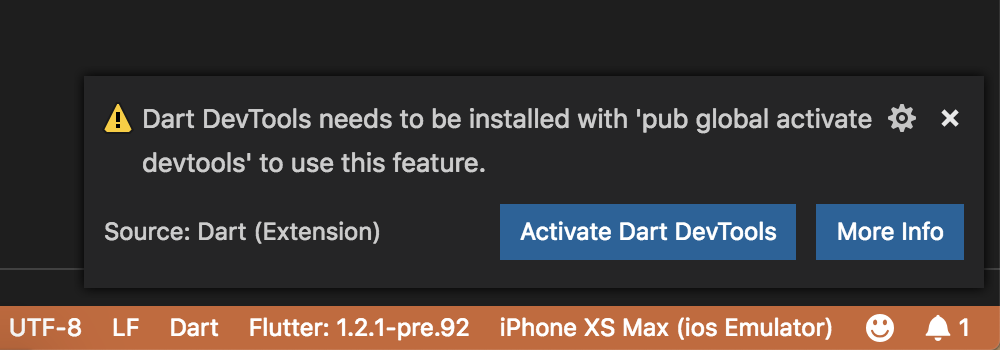
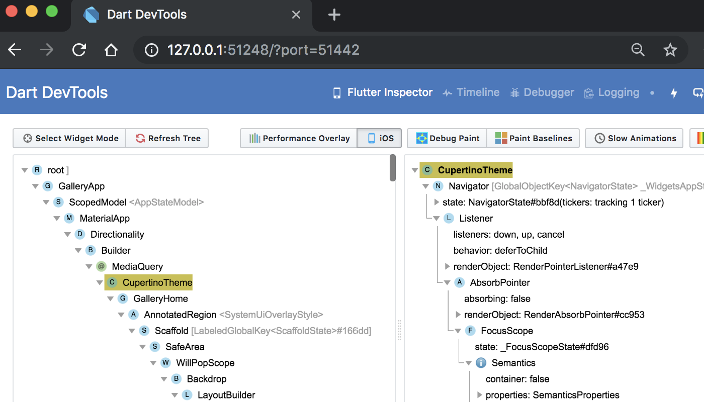
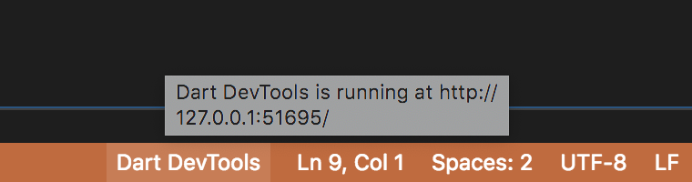

* toc
{:toc}

## Install the VS Code extensions

To use the Dart DevTools from VS Code you will need the [Dart extension](https://marketplace.visualstudio.com/items?itemName=Dart-Code.dart-code). If you're debugging Flutter applications you should also install the [Flutter extension](https://marketplace.visualstudio.com/items?itemName=Dart-Code.flutter).

## Start an application to debug

Start a debug session for your application by opening the root folder of your project (the one containing `pubspec.yaml`) in VS Code and clicking **Debug > Start Debugging** (`F5`).

## Launch DevTools

Once the debug session is active and the application has started, the **Dart: Open DevTools** command will become available in the VS Code command palette:

The first time you run this (and subsequently when the DevTools package is updated) you will be prompted to activate or upgrade DevTools.

Clicking the Activate/Upgrade button will use `pub global activate` to activate the DevTools package for you.

Next, DevTools will launch in your browser and automatically connect to your debug session.

While the Dart DevTools are active, you'll see them in the status bar of VS Code. If you've closed the browser tab, you can click on here to re-launch your browser (so long as there's still a suitable Dart/Flutter debugging session available).

