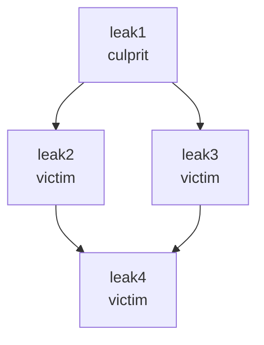

# Dart DevTools memory leak tracker

This page and functionality are under construction. See https://github.com/flutter/devtools/issues/3951.

[self-link](https://github.com/flutter/devtools/blob/master/packages/devtools_app/lib/src/screens/memory/panes/leaks/LEAK_TRACKING.md)


## Understand concepts

### Glossary

**GC**: garbage collection.

**Memory Leak**: progressive usage of more and more memory by an application, for example repetedly creating and not disposing a listener.

**Memory Bloat**: use of more memory than is necessary for optimal performance, for example using too large images or not canceling a stream.

**Object's Retaining Path**: path from the object to a root object that prevents the object from being GCed.


### Leak Types

To detect memory leaks, the tool uses the fact that, with proper memory management, a dart object disposal and GC events should happen sequentially, close to each other.

By disposal and GC events, the tool detects different types of leaks:

**Not disposed, but GCed (not-disposed)**: a disposable object was GCed, without being disposed first. This means that the object's disposable content was allocating memory, after the object became not needed. To fix the leak, invoke `dispose()` when the object is not needed.

**Disposed, but not GCed (not-GCed)**: an object was disposed, but not GCed after certain number of GC events. This means there is a retaining path that holds the object from being garbage collected, after the object became not needed. To fix the leak, after disposal assign to null all reachable references to the object:

```
myField.dispose();
myField = null;
```

**Disposed and GCed late (GCed-late)**: an object disposed and then GCed, but GC happened later than expected. This means the retaining path was holding the object in memory for some period, but then disappeared.

### Culprits and Victims

If you have a set of not-GCed objects, some of them (victims) may be not GC-ed because they are held by others (culprits). Normally, to fix the leaks, you need to fix just culprits.

**Victim**: a leaked object, for which the tool could find other leaked object, that, if fixed, would fix the first leak too.

**Culprit**: a leaked object that is not detected to be other object victim.

The tool detects which leaked objects are culprits, so you know where to focus.

For example, out of four not-GCed leaks on this diagram, only one is culprit, because, when the object is fixed and gets GCed, the objects it referenced, will be also GCed:





### Limitations

The tool detects leaks for disposable and instrumented classes only (with note that the fixed leak can fix other objects too). 

Some classes in Flutter framework are already instrumented. If you want your classes to be tracked, you need to make them disposable and [instrument](#instrument).

## Use the Leak Tracker

### Configure environment

NOTE: For Google3 applications, follow http://go/detect-memory-leaks-in-g3-flutter-app.

While the leak detection functionality is under construction, you will need the forked version of the Flutter framework.

Follow [standard Flutter installation process](https://docs.flutter.dev/get-started/install), but,
instead of downloading or cloning official Flutter, clone `git@github.com:polina-c/flutter.git`,
then checkout the branch `leak-tracking2`
and then never run `flutter upgrade` or `flutter channel`.

### Detect leaks in demo app

TODO: move the example to test/fixtures when it compiles with stable flutter.

1. Run https://github.com/polina-c/spikes/tree/master/leaking_app in profile mode (with flag `-profile`).
2. [Connect](https://docs.flutter.dev/development/tools/devtools/cli#open-devtools-and-connect-to-the-target-app) DevTools to the app 
3. Open Memory > Leaks
4. Notice message that reports not-disposed and not-GCed objects. If there are no not-GCed leaks,
resize the app window, to trigger GC events, and the message should show up:
   
```
flutter: 1 memory leaks: not disposed: 1, not GCed: 0, GCed late: 0
flutter: 3 memory leaks: not disposed: 1, not GCed: 2, GCed late: 0
```

5. Click "Analyze and Download"
6. Find two files in the folder "Download": '.yaml' and '.raw.json'. Open '.yaml' to review the leaks. You will need '.raw.json' 
if only you want to report an issue.

### Detect leaks in your Flutter app

As Flutter widgets are instrumented, you just need to turn on the leak tracking.

Invoke `ensureInitialized` and `startAppLeakTracking` before `runApp` like [the example app does](https://github.com/polina-c/spikes/blob/master/leaking_app/lib/main.dart#L7) and then follow the steps for demo app.

### Add instrumentation to your classes <a id='instrument'></a>

The tool needs to know which objects to track and it needs to know when disposal for these objects happened.

To provide this information to the tool, invoke `startObjectLeakTracking` in constructor or initializer (that is invoked only once), and `registerDisposal` in the method `dispose`
like [the example app does](https://github.com/polina-c/spikes/blob/master/leaking_app/lib/tracked_class.dart).

You can pass information, that will help you troubleshoot the leak, to the optional parameter `details`.

### Troubleshoot the detected leaks

The challenging question of the leak troubleshooting is how to find the detected leak in the code. There are tips that can help.

#### Give additional details to the tool

It helps to provide the object's details, which you want to be included into the analysis, to the tool. Be careful doing this, because storing additional information for each instance of a class may impact debug/profile performance of the application and thus make user experience
different from release one.

For example, for not disposed objects, you can provide creation call stack to `startObjectLeakTracking`:

```
startObjectLeakTracking(
   this,
   details: StackTrace.current.toString(),
);
```

or, provide some other details in a separate invocation:

```
addLeakTrackingDetails(this, 'Serves the stream $streamName.');
```
#### Evalueate the leaked objects with DevTools Memory Evaluator

the feature is under construction

