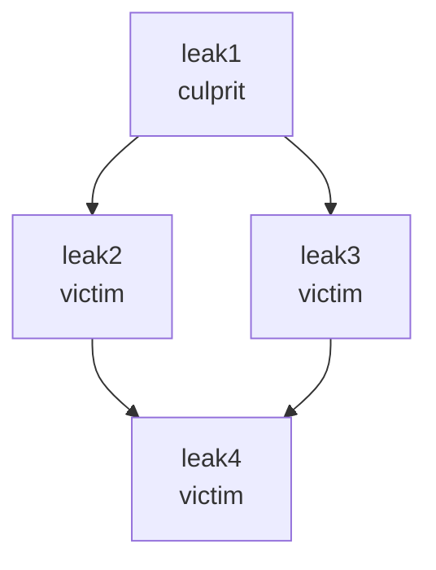

# Dart DevTools memory leak tracker

This page and functionality are under construction.
See https://github.com/flutter/devtools/issues/3951.

[self-link](https://github.com/flutter/devtools/blob/master/packages/devtools_app/lib/src/screens/memory/panes/leaks/LEAK_TRACKING.md)


## Understand concepts

### Glossary

**GC**: garbage collection. The process of reclaiming memory that is no
longer being used.

**Memory Leak**: Progressive use of more memory by an application,
for example, by repeatedly creating a listener, but not disposing of it.

**Memory Bloat**: Using more memory than is necessary for optimal performance,
for example, by using overly large images or not closing a stream.

**Object's Retaining Path**: Sequence of references from the root object
that prevents the object from being GCed.


### Leak types

To detect memory leaks, the tool assumes that, with proper memory management,
an object's disposal and garbage collection should happen sequentially,
close to each other.

By monitoring disposal and GC events, the tool detects different types of leaks:

**Not disposed, but GCed (not-disposed)**: a disposable object was GCed,
without being disposed first. This means that the object's disposable content
is using memory after the object is no longer needed.
To fix the leak, invoke `dispose()` to free up the memory.

**Disposed, but not GCed (not-GCed)**: an object was disposed,
but not GCed after certain number of GC events. This means that
a reference to the object is preventing it from being
garbage collected after it's no longer needed.
To fix the leak, after disposal assign all reachable references
of the object to null:

```
myField.dispose();
myField = null;
```

**Disposed and GCed late (GCed-late)**: an object was disposed and then GCed,
but GC happened later than expected. This means the retaining path was
holding the object in memory for some period, but then disappeared.

**Disposed, but not GCed, without path (not-GCed-without-path)**: an object
was disposed and not GCed when expected, but retaining path is not detected,
that means that the object will be most likely GCed in the next GC cycle,
and the leak will convert to **GCed-late** leak. 

### Culprits and victims

If you have a set of not-GCed objects, some of them (victims)
might not be GC-ed because they are held by others (culprits).
Normally, to fix the leaks, you need to only fix the culprits.

**Victim**: a leaked object, for which the tool could find another
leaked object that, if fixed, would also fix the first leak.

**Culprit**: a leaked object that is not detected to be the victim
of another object.

The tool detects which leaked objects are culprits, so you know where to focus.

For example, out of four not-GCed leaks on the following diagram,
only one is the culprit, because, when the object is fixed
and GCed, the victims it referenced will be also GCed:





### Limitations

The tool detects leaks for disposable and instrumented classes only
(note that fix those objects can also fix other objects).

Some classes in the Flutter framework and Dart SDK are already instrumented.
If your application is leaking these classes, the leaks will be
detected without additional effort.

If you want your classes to be leak tracked, you need to make them
disposable and [instrument](#instrument) them.

### Performance impact

The Leak Tracker stores a small additional record for each tracked alive object and for each
detected leak, that increases the memory footprint.

For the [Gallery application](https://github.com/flutter/gallery) in profile mode on `macos`
the leak tracking increased memory footprint of the home page by 400 KB that is 0.5% of
the total.


## Use the Leak Tracker

### Configure environment

NOTE: For Google3 applications,
follow http://go/detect-memory-leaks-in-g3-flutter-app.

While the leak detection functionality is under construction,
you will need the forked version of the Flutter framework.

Follow the [standard Flutter installation process](https://docs.flutter.dev/get-started/install),
but, instead of downloading or cloning official Flutter,
clone `git@github.com:polina-c/flutter.git`,
then checkout the branch `leak-tracking2`,
and then never run `flutter upgrade` or `flutter channel`.

### Detect leaks in demo Flutter app <a id='demo_flutter'></a>

TODO: move the example to test/fixtures when it compiles with stable flutter.

1. Run https://github.com/polina-c/spikes/tree/master/leaking_app
   in profile or debug mode.
2. [Connect](https://docs.flutter.dev/development/tools/devtools/cli#open-devtools-and-connect-to-the-target-app)
   DevTools to the app 
3. Open Memory > Leaks <a id='memory-leaks-page'></a>
4. Notice messages that report not-disposed and not-GCed objects.
   If there aren't any not-GCed leaks, resize the app window
   to trigger a GC event, and the following messages should show up:
   
```
flutter: 1 memory leaks: not disposed: 1, not GCed: 0, GCed late: 0
flutter: 3 memory leaks: not disposed: 1, not GCed: 2, GCed late: 0
```

5. Click "Analyze and Download"
6. Find two files in the folder "Download": '.yaml' and '.raw.json'.
   Open '.yaml' to review the leaks. You'll only need '.raw.json'
   if you report an issue.

### Detect leaks in your Flutter app

As Flutter widgets are instrumented, you just need to turn on the leak tracking.

Invoke `ensureInitialized` and `startAppLeakTracking` before
`runApp`, as shown in
[the example app,](https://github.com/polina-c/spikes/blob/master/leaking_app/lib/main.dart#L7)
and then follow the steps for the demo app.

### Add instrumentation to your classes <a id='instrument'></a>

The tool needs to know which objects to track and it needs
to know when disposal for these objects happened.

To provide this information for objects of a specific class to the tool,
invoke `startObjectLeakTracking` in the constructor or initializer
(that is invoked only once), and invoke `registerDisposal` in the `dispose` method,
as shown in
[the example app.](https://github.com/polina-c/spikes/blob/master/leaking_app/lib/tracked_class.dart)

To help you troubleshoot the leak, you can pass information
to the optional `details` parameter.

TODO(polina-c): explain how to choose which classes to instrument.

### Detect leaks in your Dart app

For Dart appliocations: 

1. Reference [memory_leak_tracker](https://github.com/polina-c/spikes/blob/master/memory_leak_tracker/README.md) in your pubspec.yaml:

TODO(polina-c): productize the library `memory_leak_tracker`.

```
dependencies:
  ...
  memory_leak_tracker:
    git:
      url: git://github.com/polina-c/spikes.git
      path: memory_leak_tracker
```

2. [Instrument](#instrument) your classes.

3. Run your app with additional flags: `dart --observe:8181 main.dart`,
   find the line `The Dart VM service is listening on`
   in the console and copy the URL, which will be something like
   `http://127.0.0.1:8181/etNluJDHZwE=/`.

4. Launch [DevTools](https://github.com/flutter/devtools) at master:
   `flutter run -d macos` and connect to the app with the copied URL. 
 
TODO(polina-c): update this step to use released version. 

5. Follow [the guidance for the demo Flutter app](demo_flutter),
   starting at [the step to open the memory screen](memory-leaks-page).


### Troubleshoot the detected leaks

The challenge when troubleshooting leaks is
how to find the detected leak in the code.
The following tips might help.

#### Give additional details to the tool

It helps to provide the object's details to the tool,
that you want to include into the analysis. Be careful doing this,
because storing additional information for each instance of a class
might impact performance of the application.

For example, for not-disposed objects, you can
provide the creation call stack to `startObjectLeakTracking`:

```
startObjectLeakTracking(
   this,
   details: StackTrace.current.toString(),
);
```

or, you can provide other details in a separate invocation:

```
addLeakTrackingDetails(this, 'Serves the stream $streamName.');
```

#### Evaluate the leaked objects with DevTools Memory Evaluator

TODO(polina-c): add content

### Detect leaks in regression testing

TODO(polina-c): add content

### Understand performance impact

TODO(polina-c): add content
