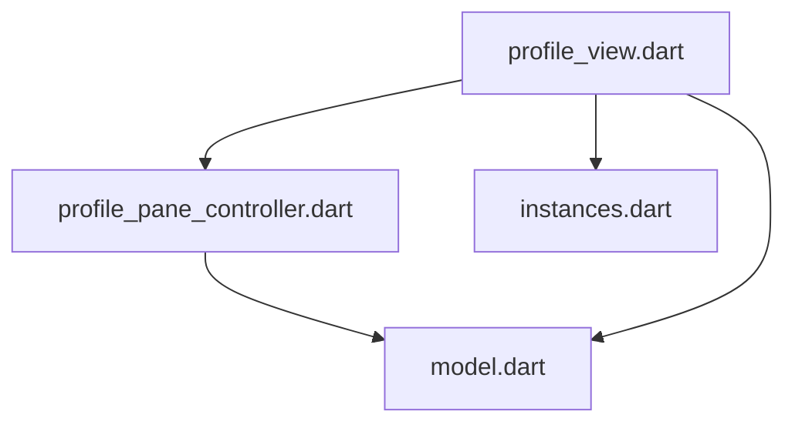

<!--
Copyright 2025 The Flutter Authors
Use of this source code is governed by a BSD-style license that can be
found in the LICENSE file or at https://developers.google.com/open-source/licenses/bsd.
-->
<!---
Generated by https://github.com/polina-c/layerlens
Dependencies that create loops (inversions) are marked with `!`.
-->

### Inversions
In this folder: 0

Including sub-folders: 0

