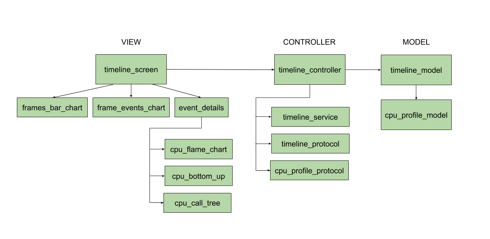

<!--
Copyright 2025 The Flutter Authors
Use of this source code is governed by a BSD-style license that can be
found in the LICENSE file or at https://developers.google.com/open-source/licenses/bsd.
-->
## Timeline Code Architecture

### View

The view has no awareness of the timeline data directly. It has access to the timeline data (frames, selected event,
selected frame, cpu profile, etc.) through the `TimelineController`. The view receives updates from the
`TimelineController` via streams.

### Model

`TimelineData` stores the current data for the DevTools timeline. Its main components include `frames`, `selectedFrame`,
`selectedEvent`, `cpuProfileData`, and `traceEvents`. This data is maintained by `TimelineController`.

### Controller

The controller manages `TimelineData` and communicates with the view to give and receive data updates. It manages data
processing via protocols `TimelineProtocol` (protocol for processing trace events and composing them into
`TimelineEvent`s and `TimelineFrame`s) and `CpuProfileProtocol` (protocol for processing `CpuProfileData` and composing
it into a structured tree of `CpuStackFrame`s). The controller also communicates with `TimelineService`, which manages
interactions between the Timeline and the VmService. `TimelineController` has no dependency on `dart:html`, making it
easily testable.
