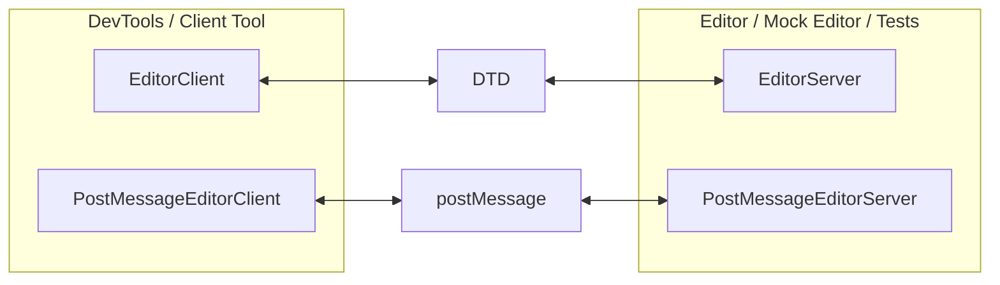

# DTD Editor Service

An editor (such as VS Code or IntelliJ) can provide services to be used by other
tools (such as the DevTools sidebar).

The original version of the sidebar in VS Code used `postMessage` but the goal
is to move to DTD and deprecate the `postMessage` support. For the transition
the DevTools sidebar will support both.

- `EditorClient` classes are used by the client tool (DevTools sidebar) to
  interact with the services provided by an editor in a strongly-typed way.
- `EditorServer` classes are used by the editor to provide those services in a
  strongly-typed way.
- `FakeEditor` is a helper mixin for `EditorServer` classes that provide some
  mock editor functionality (such as the ability to connect and disconnect mock
  devices and start debug sessions). This is used by the "mock editor" Stager
  scene to allow testing/developing the sidebar without a real editor.
- `_VsCodeConnectedPanel` is the sidebar implementation that works with the
  generic `EditorClient` class so it can work against either transport channel.

## postMessage Implementation

- `PostMessageEditorClient` is an implementation of `EditorClient` that
  communicates over `postMessage`.
- `PostMessageFakeEditor` is an implementation of `EditorServer` (that mixes in
  `FakeEditor`) that communicates over `postMessage` streams.
- `VsCodePostMessageSidebarPanel` is a widget that wraps `_VsCodeConnectedPanel`
  and provides it with a `postMessage` implementation of `EditorClient`.

## DTD Implementation

(work in progress, will be the same as above but using DTD-based implementations
of classes)
