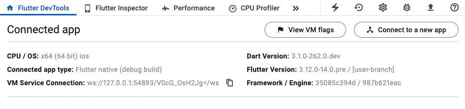

This is draft for future release notes, that are going to land on
[the Flutter website](https://docs.flutter.dev/development/tools/devtools/release-notes).

# DevTools 2.26.0 release notes

Dart & Flutter DevTools - A Suite of Performance Tools for Dart and Flutter

## General updates
* Added a new "Home" screen in DevTools that either shows the "Connect" dialog or
a summary of your connected app, depending on the connection status in DevTools. Keep an
eye on this screen for cool new features in the future. This change also enables support
for static tooling (tools that don't require a connected app) in DevTools - [#6010](https://github.com/flutter/devtools/pull/6010)

* Added an action to the main toolbar for loading offline data into DevTools - [#6003](https://github.com/flutter/devtools/pull/6003)

* Fixed overlay notifications so that they cover the area that their background blocks - [#5975](https://github.com/flutter/devtools/pull/5975)

## Inspector updates
TODO: Remove this section if there are not any general updates.

## Performance updates
TODO: Remove this section if there are not any general updates.

## CPU profiler updates
TODO: Remove this section if there are not any general updates.

## Memory updates
* Added a context menu to rename or delete a heap snapshot from the list - [#5997](https://github.com/flutter/devtools/pull/5997)
* Warn users when HTTP logging may be affecting their app's memory consumption - [#5998](https://github.com/flutter/devtools/pull/5998)

## Debugger updates
TODO: Remove this section if there are not any general updates.

## Network profiler updates
* Added a selector to customize the display type of text and json responses (thanks to @hhacker1999!) - [#5816](https://github.com/flutter/devtools/pull/5816)

## Logging updates
TODO: Remove this section if there are not any general updates.

## App size tool updates
TODO: Remove this section if there are not any general updates.

## Full commit history
More details about changes and fixes are available from the
[DevTools git log.](https://github.com/flutter/devtools/commits/master).
