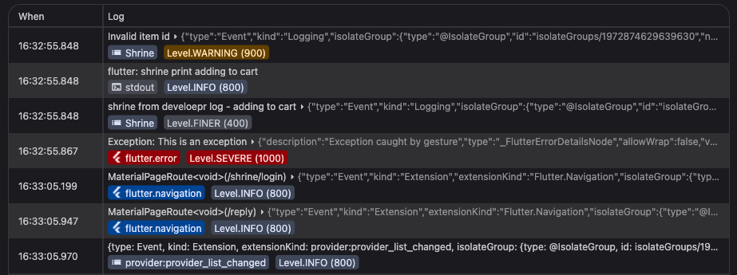
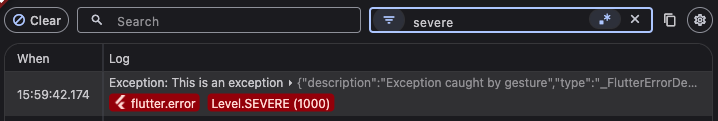
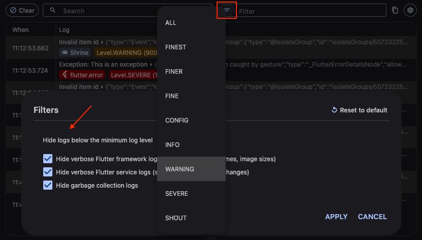

This is draft for future release notes, that are going to land on
[the Flutter website](https://docs.flutter.dev/tools/devtools/release-notes).

# DevTools 2.41.0 release notes

The 2.41.0 release of the Dart and Flutter DevTools
includes the following changes among other general improvements.
To learn more about DevTools, check out the
[DevTools overview](/tools/devtools/overview).

## General updates

* Persist filter settings across sessions. - [#8447](https://github.com/flutter/devtools/pull/8447),
[#8456](https://github.com/flutter/devtools/pull/8456)
[#8470](https://github.com/flutter/devtools/pull/8470)

## Inspector updates

- Added an option to the [new Inspector's](https://docs.flutter.dev/tools/devtools/release-notes/release-notes-2.40.1#inspector-updates)
  settings to allow auto-refreshing the widget tree after a hot-reload. - [#8483](https://github.com/flutter/devtools/pull/8483)
- Fixed an [issue](https://github.com/flutter/devtools/issues/8487) where the [new Inspector](https://docs.flutter.dev/tools/devtools/release-notes/release-notes-2.40.1#inspector-updates) would not load after a hot-restart in the legacy Inspector. - [#8491](https://github.com/flutter/devtools/pull/8491)
- Fixed an [issue](https://github.com/flutter/devtools/issues/8465) preventing scrolling to an implementation widget in the [new Inspector](https://docs.flutter.dev/tools/devtools/release-notes/release-notes-2.40.1#inspector-updates) after selecting it on the device. - [#8494](https://github.com/flutter/devtools/pull/8494)

## Performance updates

TODO: Remove this section if there are not any general updates.

## CPU profiler updates

TODO: Remove this section if there are not any general updates.

## Memory updates

TODO: Remove this section if there are not any general updates.

## Debugger updates

TODO: Remove this section if there are not any general updates.

## Network profiler updates

* Added a filter text field to the top-level Network profiler controls. -
[#8469](https://github.com/flutter/devtools/pull/8469)
    

## Logging updates

* Fetch log details immediately upon receiving logs so that log data is not lost
due to lazy loading. - [#8421](https://github.com/flutter/devtools/pull/8421)

* Reduce initial page load time. - [#8500](https://github.com/flutter/devtools/pull/8500)

* Added support for displaying metadata, such as log
severity, category, zone, and isolate -
[#8419](https://github.com/flutter/devtools/pull/8419),
[#8439](https://github.com/flutter/devtools/pull/8439),
[#8441](https://github.com/flutter/devtools/pull/8441). It is now also possible to
search and filter by these metadata values. - [#8473](https://github.com/flutter/devtools/pull/8473)
    

* Add a filter text field to the top-level Logging controls. -
[#8427](https://github.com/flutter/devtools/pull/8427)
    

* Added support for filtering by log severity / levels. -
[#8433](https://github.com/flutter/devtools/pull/8433)
    

* Added a setting to set the log retention limit. - [#8493](https://github.com/flutter/devtools/pull/8493)

* Added a button to toggle the log details display between raw text and JSON. -
[#8445](https://github.com/flutter/devtools/pull/8445)

* Fixed a bug where logs would get out of order after midnight. - 
[#8420](https://github.com/flutter/devtools/pull/8420)

* Automatically scroll logs table to the bottom on the initial load -
[#8437](https://github.com/flutter/devtools/pull/8437)

## App size tool updates

TODO: Remove this section if there are not any general updates.

## Deep links tool updates

TODO: Remove this section if there are not any general updates.

## VS Code Sidebar updates

- The legacy `postMessage` version of the VS Code sidebar has been removed in
  favor of the DTD-powered version. Trying to access the legacy sidebar will
  show a message advising to update your Dart VS Code extension. The Dart VS
  Code extension was the only user of the legacy sidebar and migrated off in
  v3.96.

## DevTools Extension updates

TODO: Remove this section if there are not any general updates.

## Full commit history

To find a complete list of changes in this release, check out the
[DevTools git log](https://github.com/flutter/devtools/tree/v2.41.0).
