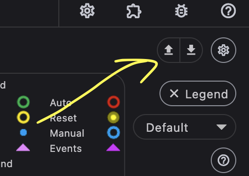
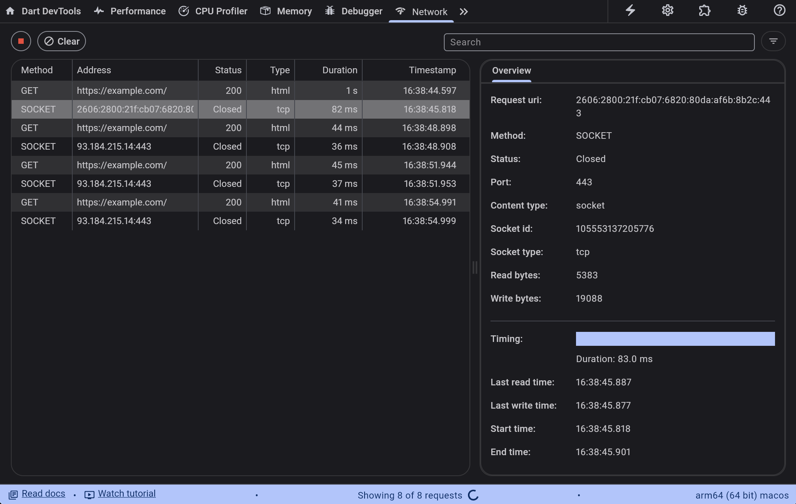

This is draft for future release notes, that are going to land on
[the Flutter website](https://docs.flutter.dev/tools/devtools/release-notes).

# DevTools 2.38.0 release notes

The 2.38.0 release of the Dart and Flutter DevTools
includes the following changes among other general improvements.
To learn more about DevTools, check out the
[DevTools overview](/tools/devtools/overview).

## General updates

TODO: Remove this section if there are not any general updates.

## Inspector updates

TODO: Remove this section if there are not any general updates.

## Performance updates

TODO: Remove this section if there are not any general updates.

## CPU profiler updates

TODO: Remove this section if there are not any general updates.

## Memory updates

* Enable offline analysis of snapshots, historical data analysis and save/load. - [#7843](https://github.com/flutter/devtools/pull/7843)

    

## Debugger updates

TODO: Remove this section if there are not any general updates.

## Network profiler updates

* Fixed issue where socket statistics were being reported as web sockets. - [#8061](https://github.com/flutter/devtools/pull/8061)

    
## Logging updates

TODO: Remove this section if there are not any general updates.

## App size tool updates

TODO: Remove this section if there are not any general updates.

## Deep links tool updates

TODO: Remove this section if there are not any general updates.

## VS Code Sidebar updates

TODO: Remove this section if there are not any general updates.

## DevTools Extension updates

* Fixed an issue where extensions did not load with the proper theme when
embedded in an IDE. - [#8034](https://github.com/flutter/devtools/pull/8034)

## Full commit history

To find a complete list of changes in this release, check out the
[DevTools git log](https://github.com/flutter/devtools/tree/v2.38.0).
