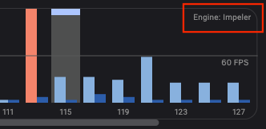

This is draft for future release notes, that are going to land on
[the Flutter website](https://docs.flutter.dev/tools/devtools/release-notes).

# DevTools 2.30.0 release notes

The 2.30.0 release of the Dart and Flutter DevTools
includes the following changes among other general improvements.
To learn more about DevTools, check out the
[DevTools overview](https://docs.flutter.dev/tools/devtools/overview).

## General updates

* Enabled DevTools extensions when debugging a Dart entry point that is not
under `lib` (e.g. a unit test or integration test). Thanks to
[@bartekpacia](https://github.com/bartekpacia) for this change! -
[#6644](https://github.com/flutter/devtools/pull/6644)

## Inspector updates
* When done typing in the search field, the next selection is now automatically selected - [#6677](https://github.com/flutter/devtools/pull/6677)
* When typing in the search field, hitting `Enter` will now select the next search result, hitting `Shift+Enter` will now select the previous result. - [#6677](https://github.com/flutter/devtools/pull/6677)
* Added package directories documentation link in settings dialog. - [#6825](https://github.com/flutter/devtools/pull/6825)

## Performance updates

* Add an indicator of the rendering engine to the Flutter Frames chart. -
[#6771](https://github.com/flutter/devtools/pull/6771)

* Improve messaging when we do not have analysis data available for a Flutter
frame. - [#6768](https://github.com/flutter/devtools/pull/6768)

## CPU profiler updates

TODO: Remove this section if there are not any general updates.

## Memory updates

TODO: Remove this section if there are not any general updates.

## Debugger updates

TODO: Remove this section if there are not any general updates.

## Network profiler updates

TODO: Remove this section if there are not any general updates.

## Logging updates

TODO: Remove this section if there are not any general updates.

## App size tool updates

TODO: Remove this section if there are not any general updates.

## VS Code Sidebar updates

* The Flutter Sidebar provided to VS Code now has the ability to enable new
  platforms if a device is available for a platform that is not enabled for
  the current project. This also requires a corresponding Dart extension for
  VS Code update to appear
  - [#6688](https://github.com/flutter/devtools/pull/6688)
* The DevTools menu in the sidebar now has now has an entry "Open in Browser"
  that opens DevTools in an external browser window even when VS Code settings
  are set to usually use embedded DevTools.
  - [#6736](https://github.com/flutter/devtools/pull/6736)

## Full commit history

To find a complete list of changes in this release, check out the
[DevTools git log](https://github.com/flutter/devtools/tree/v2.30.0).
