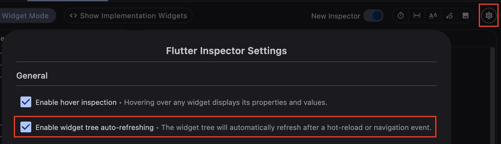

This is draft for future release notes, that are going to land on
[the Flutter website](https://docs.flutter.dev/tools/devtools/release-notes).

# DevTools 2.42.0 release notes

The 2.42.0 release of the Dart and Flutter DevTools
includes the following changes among other general improvements.
To learn more about DevTools, check out the
[DevTools overview](/tools/devtools/overview).

## General updates

* View licenses added to about dialog. - [#8610](https://github.com/flutter/devtools/pull/8610)

## Inspector updates

* Selecting an implementation widget on the device while implementation widget's are hidden in the [new Inspector's](https://docs.flutter.dev/tools/devtools/release-notes/release-notes-2.40.1#inspector-updates) does not show an error. - [#8625](https://github.com/flutter/devtools/pull/8625)
* Enabled auto-refreshes of the widget tree on hot-reloads and navigation events by default. This can be disabled in the Inspector settings. - [#8646](https://github.com/flutter/devtools/pull/8646)
    

## Performance updates

TODO: Remove this section if there are not any general updates.

## CPU profiler updates

TODO: Remove this section if there are not any general updates.

## Memory updates

TODO: Remove this section if there are not any general updates.

## Debugger updates

TODO: Remove this section if there are not any general updates.

## Network profiler updates

* Offline support added for the network screen. - [#8332](https://github.com/flutter/devtools/pull/8332)
  
## Logging updates

TODO: Remove this section if there are not any general updates.

## App size tool updates

TODO: Remove this section if there are not any general updates.

## Deep links tool updates

TODO: Remove this section if there are not any general updates.

## VS Code Sidebar updates

TODO: Remove this section if there are not any general updates.

## DevTools Extension updates

TODO: Remove this section if there are not any general updates.

## Full commit history

To find a complete list of changes in this release, check out the
[DevTools git log](https://github.com/flutter/devtools/tree/v2.42.0).
