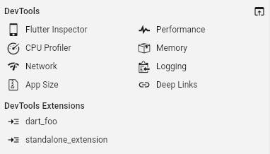

This is draft for future release notes, that are going to land on
[the Flutter website](https://docs.flutter.dev/tools/devtools/release-notes).

# DevTools 2.37.0 release notes

The 2.37.0 release of the Dart and Flutter DevTools
includes the following changes among other general improvements.
To learn more about DevTools, check out the
[DevTools overview](/tools/devtools/overview).

## General updates

* Improve messaging when a screen is unavailable for the platform of the
connected app. - [#7958](https://github.com/flutter/devtools/pull/7958)

## Inspector updates

TODO: Remove this section if there are not any general updates.

## Performance updates

* Removed the "Raster Stats" feature. This tool did not work for the Impeller rendering
engine, and the information it gave for the SKIA rendering engine was misleading and
inactionable. Users should follow official Flutter guidance for
[Performance & Optimization](https://docs.flutter.dev/perf) when debugging the
rendering performance of their Flutter apps. - [#7981](https://github.com/flutter/devtools/pull/7981).

## CPU profiler updates

TODO: Remove this section if there are not any general updates.

## Memory updates

* Enable offline analysis of snapshots, historical data analysis and save/load.
- [#7843](https://github.com/flutter/devtools/pull/7843)

    

## Debugger updates

TODO: Remove this section if there are not any general updates.

## Network profiler updates

* Display query parameters for requests. - [#7825](https://github.com/flutter/devtools/pull/7825)

## Logging updates

TODO: Remove this section if there are not any general updates.

## App size tool updates

TODO: Remove this section if there are not any general updates.

## Deep links tool updates

TODO: Remove this section if there are not any general updates.

## VS Code Sidebar updates

* Show all DevTools tools in the sidebar by default, even when there are no
debug sessions available. - [#7947](https://github.com/flutter/devtools/pull/7947)

## DevTools Extension updates

TODO: Remove this section if there are not any general updates.

## Full commit history

To find a complete list of changes in this release, check out the
[DevTools git log](https://github.com/flutter/devtools/tree/v2.37.0).
