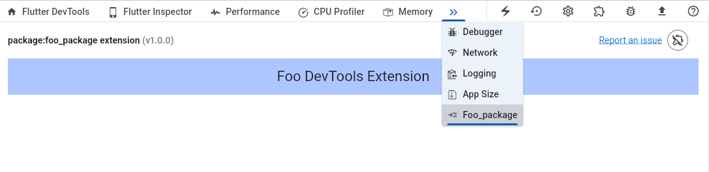

This is draft for future release notes, that are going to land on
[the Flutter website](https://docs.flutter.dev/tools/devtools/release-notes).

# DevTools 2.28.0 release notes

The 2.28.0 release of the Dart and Flutter DevTools
includes the following changes among other general improvements.
To learn more about DevTools, check out the
[DevTools overview](https://docs.flutter.dev/tools/devtools/overview).

## General updates

* Added support for DevTools extensions. This means if you are debugging an app that
depends on `package:foo`, and `package:foo` provides a DevTools extension, you will
see a "Foo" tab show up in DevTools that you can use to debug your app. To provide a
DevTools extension for your pub package, see the getting started guide for 
[package:devtools_extensions](https://pub.dev/packages/devtools_extensions)!

* Fixed theming bug in isolate selector - [#6403](https://github.com/flutter/devtools/pull/6403)
* Show the hot reload button for Dart server apps that support hot reload -
[#6341](https://github.com/flutter/devtools/pull/6341)
* Fixed exceptions on hot restart - [#6451](https://github.com/flutter/devtools/pull/6451), [#6450](https://github.com/flutter/devtools/pull/6450)

## Inspector updates

TODO: Remove this section if there are not any general updates.

## Performance updates

TODO: Remove this section if there are not any general updates.

## CPU profiler updates

TODO: Remove this section if there are not any general updates.

## Memory updates

TODO: Remove this section if there are not any general updates.

## Debugger updates

TODO: Remove this section if there are not any general updates.

## Network profiler updates

TODO: Remove this section if there are not any general updates.

## Logging updates

* Improved responsiveness of the top bar on the Logging view -
  [#6281](https://github.com/flutter/devtools/pull/6281)

* Added the ability to copy filtered logs -
  [#6260](https://github.com/flutter/devtools/pull/6260)

  

## App size tool updates

TODO: Remove this section if there are not any general updates.

## Full commit history

To find a complete list of changes in this release, check out the
[DevTools git log](https://github.com/flutter/devtools/tree/v2.28.0).