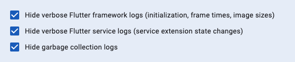

This is draft for future release notes, that are going to land on
[the Flutter website](https://docs.flutter.dev/tools/devtools/release-notes).

# DevTools 2.32.0 release notes

The 2.32.0 release of the Dart and Flutter DevTools
includes the following changes among other general improvements.
To learn more about DevTools, check out the
[DevTools overview](https://docs.flutter.dev/tools/devtools/overview).

## General updates

* Improved overall usability by making the DevTools UI more dense. This
significantly improves the user experience when using DevTools embedded in
an IDE. (#7030)[https://github.com/flutter/devtools/pull/7030]
* Added support for filtering with regular expressions in the Logging, Network, and CPU profiler
pages - (#7027)[https://github.com/flutter/devtools/pull/7027]

## Inspector updates

TODO: Remove this section if there are not any general updates.

## Performance updates

TODO: Remove this section if there are not any general updates.

## CPU profiler updates

TODO: Remove this section if there are not any general updates.

## Memory updates

TODO: Remove this section if there are not any general updates.

## Debugger updates

* Highlighted `extension type` as a declaration keyword,
  highlight the `$` in identifier interpolation as part of the interpolation,
  and properly highlight comments within type arguments. - [#6837](https://github.com/flutter/devtools/pull/6837)

## Network profiler updates

TODO: Remove this section if there are not any general updates.

## Logging updates

* Added toggle filters to filter out noisy Flutter and Dart logs - [#7026](https://github.com/flutter/devtools/pull/7026)

    

* Added scrollbar to details pane. - [#6917](https://github.com/flutter/devtools/pull/6917)

## App size tool updates

TODO: Remove this section if there are not any general updates.

## VS Code Sidebar updates

* Fixed an issue that prevented the VS code sidebar from loading in recent beta/master builds. - [#6984](https://github.com/flutter/devtools/pull/6984)

## DevTools Extension updates

* Added a description and link to documentation to the `devtools_options.yaml` file
that is created in a user's project. - [#7052](https://github.com/flutter/devtools/pull/7052)

## Full commit history

To find a complete list of changes in this release, check out the
[DevTools git log](https://github.com/flutter/devtools/tree/v2.31.0).
