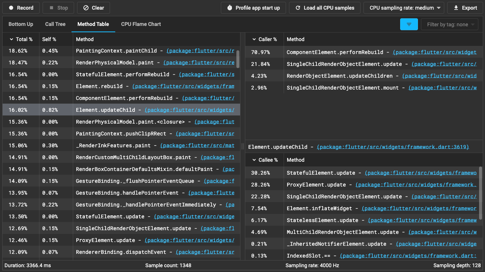

This is draft for future release notes, that are going to land on
[the Flutter website](https://docs.flutter.dev/development/tools/devtools/release-notes).

# DevTools 2.23.0 release notes

Dart & Flutter DevTools - A Suite of Performance Tools for Dart and Flutter

## General updates
* Use the default Flutter service worker - [#5331](https://github.com/flutter/devtools/pull/5331)

## Inspector updates
TODO: Remove this section if there are not any general updates.

## Performance updates
* Persist a user's preference for whether the Flutter Frames chart should be shown by default. - [#5339](https://github.com/flutter/devtools/pull/5339)

## CPU profiler updates
* Add a Method Table to the CPU profiler - [#5366](https://github.com/flutter/devtools/pull/5366)

* Add ability to inspect statistics for a CPU profile - [#5340](https://github.com/flutter/devtools/pull/5340)
* Fix a bug where Native stack frames were missing their name - [#5344](https://github.com/flutter/devtools/pull/5344)
* Fix an error in total and self time calculations for the bottom up tree - [#5348](https://github.com/flutter/devtools/pull/5348)

## Memory updates
* Fix filtering bug in the "Trace Instances" view - [#5406](https://github.com/flutter/devtools/pull/5406)

## Debugger updates
* Fix a bug where variable inspection for instances sometimes showed no children. - [#5356](https://github.com/flutter/devtools/pull/5356)
* Hide "search in file" dialog if "file search" dialog is open - [#5393](https://github.com/flutter/devtools/pull/5393)
* Fix file search bug where last letter disappeared when searching at end of file name - [#5397](https://github.com/flutter/devtools/pull/5397)
* Add search icon in file bar to make file search more discoverable - [#5351](https://github.com/flutter/devtools/issues/5351)

## Network profiler updates
* Fix a bug viewing JSON responses with null values - [#5424](https://github.com/flutter/devtools/pull/5424)

## Logging updates
TODO: Remove this section if there are not any general updates.

## App size tool updates
TODO: Remove this section if there are not any general updates.

## Changelog
More details about changes and fixes are available in the DevTools
[changelog](https://github.com/flutter/devtools/blob/master/CHANGELOG.md).
