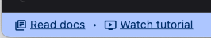
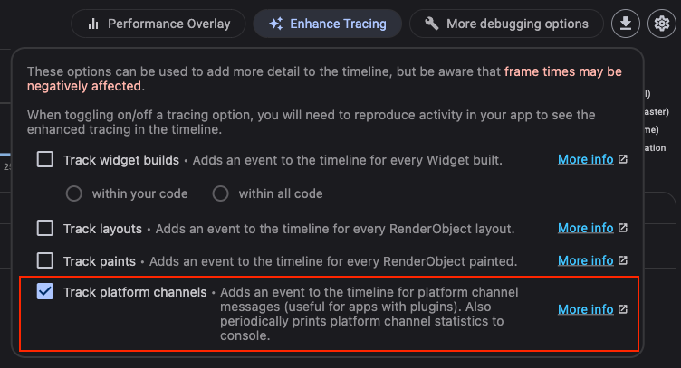

This is draft for future release notes, that are going to land on
[the Flutter website](https://docs.flutter.dev/tools/devtools/release-notes).

# DevTools 2.29.0 release notes

The 2.29.0 release of the Dart and Flutter DevTools
includes the following changes among other general improvements.
To learn more about DevTools, check out the
[DevTools overview](https://docs.flutter.dev/tools/devtools/overview).

## General updates

* Added a link to the new "Dive in to DevTools" YouTube
[video](https://www.youtube.com/watch?v=_EYk-E29edo) in the bottom status bar. This
video provides a brief tutorial for each DevTools screen.
[#6554](https://github.com/flutter/devtools/pull/6554)

    

* Fix a bug with service extension states not being cleared on app disconnect.
[#6547](https://github.com/flutter/devtools/pull/6547)
- Improved styling of bottom status bar when connected to an app. [#6525](https://github.com/flutter/devtools/pull/6525)

## Inspector updates

TODO: Remove this section if there are not any general updates.

## Performance updates

* Added an option in the "Enhance Tracing" menu for tracking platform channel
activity. This is useful for apps with plugins.

    

* Made the Performance screen available when there is no connected app. Performance data that was
previously saved from DevTools can be reloaded for viewing from this screen. [#6567](https://github.com/flutter/devtools/pull/6567)
* Added an "Open" button to the Performance controls for loading data that was previously saved
from DevTools. [#6567](https://github.com/flutter/devtools/pull/6567)

## CPU profiler updates

* Tree guidelines are now always enabled for the "Bottom Up" and "Call Tree" tabs. [#6534](https://github.com/flutter/devtools/pull/6534)
* Made the CPU profiler screen available when there is no connected app. CPU profiles that were
previously saved from DevTools can be reloaded for viewing from this screen. [#6567](https://github.com/flutter/devtools/pull/6567)
* Added an "Open" button to the CPU profiler controls for loading data that was previously saved
from DevTools. [#6567](https://github.com/flutter/devtools/pull/6567)

## Memory updates

TODO: Remove this section if there are not any general updates.

## Debugger updates

TODO: Remove this section if there are not any general updates.

## Network profiler updates

* Network statuses now show with an error color when the request failed [#6527](https://github.com/flutter/devtools/pull/6527)

## Logging updates

TODO: Remove this section if there are not any general updates.

## App size tool updates

TODO: Remove this section if there are not any general updates.

## VS Code Sidebar updates

* When using VS Code with a light theme, the embedded sidebar provided by DevTools will now also show in the light theme

## Full commit history

To find a complete list of changes in this release, check out the
[DevTools git log](https://github.com/flutter/devtools/tree/v2.29.0).
