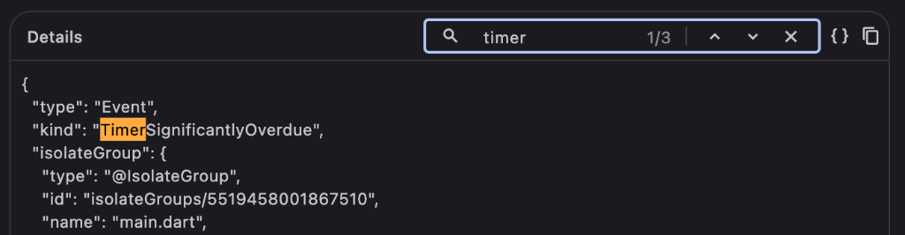

<!--
Copyright 2025 The Flutter Authors
Use of this source code is governed by a BSD-style license that can be
found in the LICENSE file or at https://developers.google.com/open-source/licenses/bsd.
-->
This is a draft for future release notes that are going to land on
[the Flutter website](https://docs.flutter.dev/tools/devtools/release-notes).

# DevTools 2.57.0 release notes

The 2.57.0 release of the Dart and Flutter DevTools
includes the following changes among other general improvements.
To learn more about DevTools, check out the
[DevTools overview](https://docs.flutter.dev/tools/devtools).

## General updates

- TODO: Remove this section if there are not any updates.

## Inspector updates

TODO: Remove this section if there are not any updates.

## Performance updates

TODO: Remove this section if there are not any updates.

## CPU profiler updates

TODO: Remove this section if there are not any updates.

## Memory updates

TODO: Remove this section if there are not any updates.

## Debugger updates

TODO: Remove this section if there are not any updates.

## Network profiler updates

- Added response size column to the Network tab and displayed response size in the request inspector overview. -
  [#9744](https://github.com/flutter/devtools/pull/9744)

- Added a filter setting to hide HTTP-profiler socket data. [#9698](https://github.com/flutter/devtools/pull/9698)

## Logging updates

- Added support for searching within the log details view (raw text mode). [#9712](https://github.com/flutter/devtools/pull/9712)
  

## App size tool updates

- Added documentation links and improved handling for null files. [#9689](https://github.com/flutter/devtools/pull/9689)

## Deep links tool updates

TODO: Remove this section if there are not any updates.

## VS Code sidebar updates

TODO: Remove this section if there are not any updates.

## DevTools extension updates

TODO: Remove this section if there are not any updates.

## Advanced developer mode updates

TODO: Remove this section if there are not any updates.

## Full commit history

To find a complete list of changes in this release, check out the
[DevTools git log](https://github.com/flutter/devtools/tree/v2.57.0).
