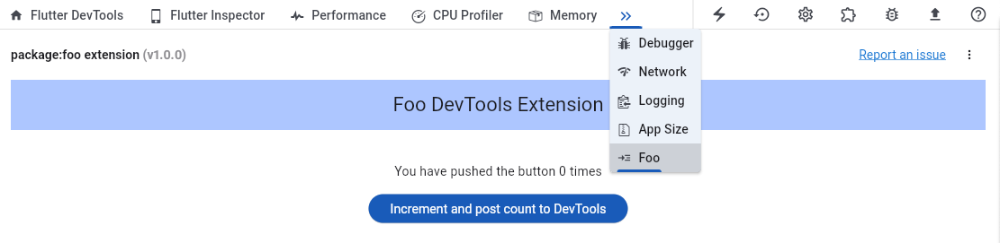
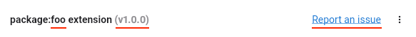
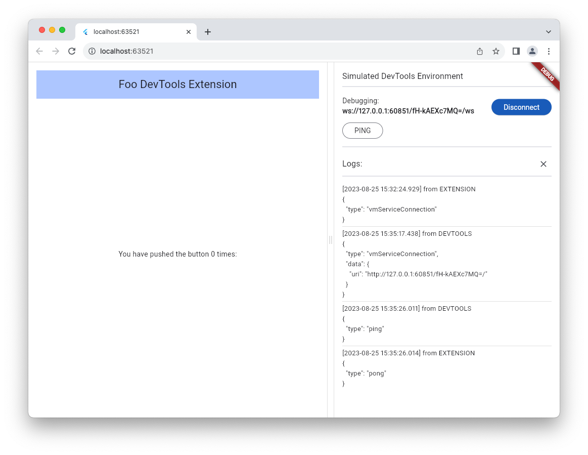

# Dart & Flutter DevTools Extensions

Extend Dart & Flutter's developer tool suite,
[Dart DevTools](https://docs.flutter.dev/tools/devtools/overview), with your own custom tool.
DevTools' extension framework allows you to build tools that can leverage existing frameworks
and utilities from DevTools (VM service connection, theming, shared widgets, utilities, etc.).

You can add a DevTools extension to an existing pub package, or you can create a new package
that provides a DevTools extension only. In both these scenarios, the end-user must list a
dependency on the package providing the DevTools extension in order to see the extension
in DevTools.

When DevTools detects an extension is available, either from the user's app or their IDE,
the extension will show up in its own DevTools tab. The DevTools extension's content, a
Flutter web app, is embedded in an iFrame displayed dynamically in DevTools.



### What types of tools are supported?

With the DevTools extensions framework you can build many types of tools, including:
- Companion tools for existing packages
- New tools that are shipped as their own package
- Tools that interact with a running application 
- Tools that **do not** interact with a running application 
- Tools that interact with project files opened in the IDE
- _Planned for the future_: tools that interact with the Analysis server (upvote this
[issue](https://github.com/flutter/devtools/issues/7658) if you want this feature sooner!)

The DevTools Extensions framework comes with out of the box features that make
distributing your extension to users seamless:
- Users can use your tool from DevTools in the browser
- Users can use your tool embedded directly in their IDE
- Users can discover and open your tool from Dart & Flutter supported IDEs

Follow the instructions below to get started, and use the
[end-to-end example](https://github.com/flutter/devtools/tree/master/packages/devtools_extensions/example/)
for reference.

# Table of contents
1. [Setup your package hierarchy](#step-1-setup-your-package-hierarchy)
2. [Create a DevTools extension](#create-a-devtools-extension)
      - [Step 1: Setup your package hierarchy](#setup-your-package-hierarchy)
        - [Standalone extensions](#standalone-extensions)
        - [Companion extensions](#companion-extensions)
      - [Step 2: Configure your extension](#step-2-configure-your-extension)
      - [Step 3: Build your extension](#step-3-build-your-extension)
      - [Step 4: Debug your extension](#step-4-debug-your-extension)
3. [Publish your package with a DevTools extension](#publish-your-package-with-a-DevTools-extension)
4. [Resources and support](#resources-and-support)

## Supported tools

With the DevTools extensions framework you can build many types of tools, including:
- Companion tools for existing packages
- New tools that are shipped as their own package
- Tools that require a running application
- Tools that **do not** require a running application

The DevTools Extensions framework comes with some out of the box features that make
distributing your extension to users seamless:
- Users can use your tool from DevTools in the browser
- Users can use your tool embedded directly in their IDE
- Users can discover and open your tool from Dart & Flutter supported IDEs

## Create a DevTools Extension

### Step 1: Setup your package hierarchy

#### Standalone extensions

For a standalone extension (an extension that is not being shipped as part of an existing
pub package), it is acceptable to include your extension source code in the same package
that the extension is shipped with. This will simplify development, and since users of your
package will add a dependency on your package as a `dev_dependency`, the size of your
package will not affect the user's app size. Your package structure will look like this:

```
my_new_tool
  extension/
    devtools/
      build/
        ...  # pre-compiled output of the Flutter web app under lib/
      config.yaml
  lib/  # source code for your extension Flutter web app
    src/
      ...
```

Since the extension must be built as a Flutter web app, use `flutter create` to generate
the package for your DevTools extension:

```console
flutter create --template app --platforms web my_new_tool
```

Now, use the `my_new_tool` package to [configure your extension](#configure-your-extension)
in the next step.

#### Companion extensions

For a companion extension (an extension that is shipped as part of an existing pub package),
we recommend that you place your extension source code outside of your pub package. This
will help keep your package size as small as possible, since you will want to avoid inflating
the size of user apps that depend on your package. Here is the recommended package structure:

```
some_pkg/  # formerly the repository root of your pub package
  packages/
    some_pkg/  # your pub package
      extension/
        devtools/
          build/
            ...  # pre-compiled output of some_pkg_devtools_extension/lib
          config.yaml
    some_pkg_devtools_extension/
      lib/  # source code for your extension Flutter web app
```

### Step 2: Configure your extension

In the Dart package that will provide the DevTools extension to users,
add a top-level `extension` directory:
```
some_pkg
  extension/
  lib/
  ...
```

Under this directory, create the following structure:
```
extension
  devtools/
    build/
    config.yaml
```

The `config.yaml` file contains metadata that DevTools needs to load the extension.

```yaml
name: some_pkg
issueTracker: <link_to_your_issue_tracker.com>
version: 0.0.1
materialIconCodePoint: '0xe0b1'
requiresConnection: true  # optional field - defaults to true
```

Copy the `config.yaml` file content above and paste it into the `config.yaml` file you just 
created in your package. **It is important that you use the exact file name and field names
as shown, or else your extension may fail to load in DevTools.**

For each key, fill in the appropriate value for your package. 
* `name`: the package name that this DevTools extension belongs to. The value of this field 
will be used in the extension page title bar. **(required)**
* `issueTracker`: the url for your issue tracker. When a user clicks the “Report an issue” 
link in the DevTools UI, they will be directed to this url. **(required)**
* `version`: the version of your DevTools extension. This version number should evolve over 
time as you ship new features for your extension. The value of this field will be used in the 
extension page title bar. **(required)**

  

* `materialIconCodePoint`: corresponds to the codepoint value of an icon from
[material/icons.dart](https://github.com/flutter/flutter/blob/master/packages/flutter/lib/src/material/icons.dart).
This icon will be used for the extension’s tab in the top-level DevTools tab bar. **(required)**

  

* `requiresConnection`: whether the extension requires a connected Dart or Flutter app to
use. This is an optional field that will default to `true` if unspecified. **(optional)**

For the most up-to-date documentation on the `config.yaml` spec, see
[extension_config_spec.md](https://github.com/flutter/devtools/blob/master/packages/devtools_extensions/extension_config_spec.md)

Now it is time to build your extension.

### Step 3: Build your extension

1. Create the Flutter web app 
    - **Skip this step if you are building a standalone extension, since you already did
  this when you set up your package hierarchy.**

    From the directory where you want your extension source code to live, run the following
    command, replacing `some_pkg_devtools_extension` with 
    `<your_package_name>_devtools_extension``:
    ```console
    flutter create --template app --platforms web some_pkg_devtools_extension
    ```

2. Add the `package:devtools_extensions` dependency to your extension Flutter web app.

   ```console
   flutter pub add devtools_extensions
   ```

   You will likely also want to add a dependency on
   [package:devtools_app_shared](https://pub.dev/packages/devtools_app_shared), which contains
   shared services, utilities, and UI components for you to use while building your extension.
   See [devtools_app_shared/example](https://github.com/flutter/devtools/tree/master/packages/devtools_app_shared/example)
   for sample usages.

   ```console
   flutter pub add devtools_app_shared
   ```

3. Add the `DevToolsExtension` widget at the root of your Fluter web app.

    In `lib/main.dart`, add the following:
    ```dart
    import 'package:devtools_extensions/devtools_extensions.dart';
    import 'package:flutter/material.dart';

    void main() {
      runApp(const SomePkgDevToolsExtension());
    }

    class SomePkgDevToolsExtension extends StatelessWidget {
      const SomePkgDevToolsExtension({super.key});

      @override
      Widget build(BuildContext context) {
        return const DevToolsExtension(
          child: Placeholder(), // Build your extension here
        );
      }
    }
    ```

    The `DevToolsExtension` widget automatically performs all extension initialization required
    to interact with DevTools. From anywhere in your extension web app, you can access the globals:
      - `extensionManager`: a manager for interacting with DevTools or the extensions framework
      - `serviceManager`: a manager for interacting with the connected vm service, if present
      - `dtdManager`: a manager for interacting with the Dart Tooling Daemon, if present

### Step 4: Debug your extension

#### Use the Simulated DevTools Environment (recommended for development)

For debugging purposes, you will likely want to use the "simulated DevTools environment". This
is a simulated environment that allows you to build your extension without having to develop it
as an embedded iFrame in DevTools. Running your extension this way will wrap your extension
with an environment that simulates the DevTools-to-extension connection. It also
gives you access to hot restart and a faster development cycle.


1. Your DevTools extension.
2. The VM service URI for a test app that your DevTools extension will interact with. This app
should depend on your extension’s parent package.
3. Buttons to perform actions that a user may trigger from DevTools.
4. Logs showing the messages that will be sent between your extension and DevTools.

The simulated environment is enabled by an environment parameter `use_simulated_environment`.
To run your extension web app with this flag enabled, add a configuration to your `launch.json`
file in VS code:
```json
{
    ...
    "configurations": [
        ...
        {
            "name": "some_pkg_devtools_extension + simulated environment",
            "cwd": "packages/some_pkg_devtools_extension",
            "request": "launch",
            "type": "dart",
            "args": [
                "--dart-define=use_simulated_environment=true"
            ],
        },
    ]
}
```

or launch your app from the command line with the added flag:
```console
flutter run -d chrome --dart-define=use_simulated_environment=true
```

#### Use a real DevTools Environment

To use a real DevTools environment, you will need to perform a series of setup steps:

1. Develop your extension to a point where you are ready to test your changes in a
real DevTools environment. Build your flutter web app and copy the built assets from
`your_extension_web_app/build/web` to your pub package's `extension/devtools/build` directory.

    Use the `build_and_copy` command from `package:devtools_extensions` to help with this step.
    ```sh
    cd your_extension_web_app;
    flutter pub get;
    dart run devtools_extensions build_and_copy --source=. --dest=../some_pkg/extension/devtools
    ```

    To ensure that your extension is setup properly for loading in DevTools, run the
    `validate` command from `package:devtools_extensions`. The `--package` argument
    should point to the root of the Dart package that this extension will be published
    with.
    ```sh
    cd your_extension_web_app;
    flutter pub get;
    dart run devtools_extensions validate --package=../some_pkg
    ```

2. Prepare and a test environment with a dependency on your pub package that is providing the
extension.
    - In the Dart or Flutter project where you are adding a dependency on your package, add a
    [path](https://dart.dev/tools/pub/dependencies#path-packages) dependency that points to your
    local package source code (the package that contains the `extension/devtools/` directory with
    your extension's assets). Once you have done this, run `pub get` on the package.
      - If your extension requires a running application, then you'll need to run the app that
      depends on your extension.
      - If your extension does not requires a running application, then you will need to
      open the test Dart or Flutter project that depends on your package in a supported IDE
      (VS Code or IntelliJ / Android Studio).

3. Start DevTools in one of the following ways:
    - **If your extension requires a running app**, you can open DevTools either from the URI
    that was printed to command line when you ran the test app, or from the IDE where you
    ran your test app.
    - **If your extension does not require a running app**, you can open your Dart or Flutter
    project that depends on your package in a supported IDE (VS Code or IntelliJ / Android Studio).
    Open DevTools from the IDE to see your extension in the browser.
      - Requires Dart SDK >= 3.5 and Flutter SDK >= 3.23
    - **If you need local or unreleased changes from DevTools**, you'll need to build and run 
    DevTools from source. See the DevTools [CONTRIBUTING.md]() for a guide on how to do this.
    You'll need to build DevTools with the server and the front end to test extensions - see
    [instructions](https://github.com/flutter/devtools/blob/master/CONTRIBUTING.md#development-devtools-server--devtools-flutter-web-app).

4. Connect your test app to DevTools if it is not connected already, and you should see a tab
in the DevTools app bar for your extension. The enabled or disabled state of your extension is
managed by DevTools, which is exposed from an "Extensions" menu in DevTools, available from the
action buttons in the upper right corner of the screen.

## Publish your package with a DevTools extension

In order for a package to provide a DevTools extension to its users, it must be published with the
expected content in the `your_package/extension/devtools/` directory (see the
[setup instructions](#setup-your-package-hierarchy) above).

1. Ensure the `extension/devtools/config.yaml` file exists and is configured per the
[specifications above](#setup-your-package-hierarchy). You can run the `validate` command
from `package:devtools_extensions` to verify.
    ```sh
    cd your_extension_web_app;
    flutter pub get;
    dart run devtools_extensions validate --package=path/to/pkg_providing_your_extension_assets
    ```

2. Use the `build_and_copy` command provided by `package:devtools_extensions` to build
your extension and copy the output to the `extension/devtools` directory:
    ```sh
    cd your_extension_web_app;
    flutter pub get;
    dart run devtools_extensions build_and_copy --source=. --dest=../some_pkg/extension/devtools
    ```

Then publish your package. When running `pub publish`, you will see a warning if you
do not have the `config.yaml` file and a non-empty `build` directory as required.

### What if I don't want the `extension/devtools/build/` contents checked into source control?

As a package author, the content that you check into your git repository is completely up to you.
If you want the contents of `extension/devtools/build/` to be git ignored, then you'll just need
to ensure that the extension web app is always built and included in `extension/devtools/build/`
when you publish your package. To do so, add the following to a `.pubignore` file in the
`extension/devtools/` directory:

```
!build
```

This will ensure that, even if the `extension/devtools/build` directory has been been git
ignored, the directory will still be included when publishing the package on pub.

To verify the published extension contents are always up to date, consider adding a tool
script to your repo that looks something like this:

**publish.sh**
```sh
pushd your_extension_web_app

flutter pub get
dart run devtools_extensions build_and_copy --source=. --dest=../your_pub_package/extension/devtools

popd

pushd your_pub_package
flutter pub publish
popd
```

## Resources and support

Please join the [Flutter Discord server](https://github.com/flutter/flutter/wiki/Chat) and then check out
the [#devtools-extension-authors](https://discord.com/channels/608014603317936148/1159561514072690739)
channel to connect with other DevTools extension authors and the DevTools team.

For feature requests or bugs, please [file an issue](https://github.com/flutter/devtools/issues/new)
on the DevTools Github repository.
