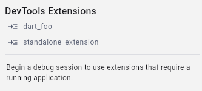

# DevTools extension examples
This directory contains end-to-end examples of DevTools extensions. Each
end-to-end example is made up of three components:
1. **Extension-providing package**: Dart package that provides the extension
2. **DevTools extension web app**: the tool itself
3. **End-user application**: the app that the extension is used on

## Extension-providing package

This is the Dart package that provides a DevTools extension for end-user
applications to use in DevTools. Depending on whether the extension is going to
be shipped as part of an existing package or as a standalone package, this may be
a different package than the one containing the extension source code. There are
multiple extension-providing packages in the `example` directory.

* `package:foo` from `packages_with_extensions/foo/packages/foo`: a package for Flutter apps.

* `package:dart_foo` from `packages_with_extensions/dart_foo/packages/dart_foo`: a
pure Dart package for Dart or Flutter apps.

* `package:standalone_extension` from `packages_with_extensions/standalone_extension`: a developer 
tool intended to be imported by users as a `dev_dependency`. This is different from the other
examples in that it is not an extension shipped with an existing Dart package. It is a package
published solely to provide a developer tool as a DevTools extension.

<!-- TODO(kenz): build this example, or pull in Khan's extension. -->
<!-- - `package:gemini_ai_tool` from `packages_with_extensions/dart_foo/packages/gemini_ai_tool`, which is a standalone tool (like `package:standalone_tool`)
that provides an example of using the Gemini SDK to build an AI powered tool
as a DevTools extension. -->

## DevTools extension web app

These are Flutter web apps that will be embedded in DevTools when connected to an app
that depends on the [extension-providing package](#extension-providing-package).

* `packages_with_extensions/foo/packages/foo_devtools_extension`: this
is the Flutter web app whose built assets are included in `package:foo`'s
`extension/devtools/build` directory.

* `packages_with_extensions/dart_foo/packages/dart_foo_devtools_extension`: this
is the Flutter web app whose built assets are included in `package:dart_foo`'s
`extension/devtools/build` directory.

* `packages_with_extensions/standalone_extension`: this package is both the extension-providing
package, _and_ the Flutter web app for the tool itself. The built assets of this Flutter web app are
included in `package:standalone_extension`'s  `extension/devtools/build` directory.

## End-user application

These are the applications that depend on the
[extension-providing package](#extension-providing-package) and
can use to the [DevTools extension](#devtools-extension-web-app) provided by the parent package.

### `app_that_uses_foo`

This Flutter app depends on multiple packages from `packages_with_extensions`
that provide a DevTools extension:
* `package:foo`
* `package:dart_foo`
* `package:standalone_extension`

#### Runtime extensions

When debugging `app_that_uses_foo`, or one if its `bin/` or `test/` libraries,
the DevTools extensions provided by the `app_that_uses_foo`'s  dependencies
will load in their own tab in DevTools. Try any of the following options and open
DevTools to see the extensions available for the different run targets.

From the `app_that_uses_foo` directory, run:
* `flutter run` to run the Flutter app.
* `dart run --observe bin/script.dart` to run a Dart CLI app.
* `dart test test/nested/dart_test_1.dart --pause-after-load` to run a Dart test.
* `flutter test test/flutter_test_1.dart --start-paused` to run a Flutter test.

#### Static extensions

Some extensions are available without a connected application. We refer to these as
"static extensions". Packages providing extensions can declare whether a connection
is required by adding a field `requiresConnection` to the `extension/devtools/config.yaml`
file.

For instance, the extension examples `package:dart_foo` and `package:standalone_extension`
both set `requiresConnection: false` in their `extension/devtools/config.yaml` files.

To see how static extensions are made available to an end user, open `app_that_uses_foo` in VS Code.
Open the Flutter sidebar panel in VS Code to see a list of any static extensions that are available.



> Note: The [Flutter panel](https://github.com/flutter/flutter-intellij/issues/7299) and the ability
to use [DevTools extensions embedded in the IDE](https://github.com/flutter/flutter-intellij/issues/7195)
are coming soon to IntelliJ and Android Studio.

## Learn how to structure your Dart package

The examples will show you how to structure your package for optimal extension
development and publishing.

1. If you are adding a DevTools extension to an existing Dart package, this is
the recommended structure:
    ```
    foo/  # formerly the repository root of your pub package
        packages/
            foo/  # your pub package
            extension/
                devtools/
                build/
                    ...  # pre-compiled build output of foo_devtools_extension
                config.yaml
            foo_devtools_extension/  # source code for your extension
    ```
    `package:foo` and `package:dart_foo` provide an example of this structure.

2. If you are creating a DevTools extension as a standalone package, this is
the recommended structure:
    ```
    standalone_tool/ # your new pub package
        extension/
            devtools/
            build/
                ...  # pre-compiled build output of standalone_tool
            config.yaml
        lib/  # source code for your extension
    ```
    `package:standalone_extension` provides an example of this structure.
    
The pre-compiled build output included in the example packages'
`extension/devtools/build` directories were included using the `build_and_copy`
command provided by `package:devtools_extensions`.
  * For example, `package:foo`'s `extension/devtools/build` directory was populated
  by running the following command from the `foo_devtools_extension/` directory:

    ```sh
    flutter pub get &&
    dart run devtools_extensions build_and_copy \
        --source=. \
        --dest=../foo/extension/devtools 
    ```
## Learn how to configure your extension's `config.yaml` file

In these examples, you will also learn how to properly configure your extension's
`config.yaml` file. DevTools reads this file in order to embed your extension in its
own tab. This file must be configured as shown. 

```yaml
name: foo
issueTracker: <link_to_your_issue_tracker.com>
version: 0.0.1
materialIconCodePoint: '0xe0b1'
```

For the most up-to-date documentation on the `config.yaml` spec, see
[extension_config_spec.md](https://github.com/flutter/devtools/blob/master/packages/devtools_extensions/extension_config_spec.md)

## Learn how to use shared packages from DevTools

To learn how to use the shared packages from Devtools (`package:devtools_extensions`
and `package:devtools_app_shared`), see the source for the `package:foo` extension.

`packages_with_extensions/foo/packages/foo_devtools_extension` provides in-depth
examples of how to do things like interact with the connected app's VM service,
read / write to the user's project files over the Dart Tooling Daemon, interact
with the DevTools extension framework APIs, etc.
