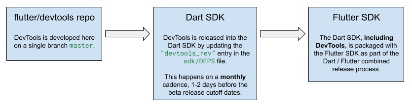

> [!NOTE] 
> There are parts of this release process that can only be completed by Googlers
on the Dash team. If you are not a Googler on the Dash team, please reach out on the
[#hackers-devtools](https://discord.com/channels/608014603317936148/1106667330093723668)
Discord channel before trying to create a DevTools release.

# DevTools release process



A new minor version of DevTools should be released into the Dart SDK **monthly**.
This release should be timed with the Dart / Flutter release code cutoff dates so
that we can ensure it is included with the next Flutter beta (see the
[Dash release schedule](http://go/dash-team-releases)). The minor DevTools releases
must be submitted to the Dart SDK before the Beta release cutoff date. Dev or patch
releases of DevTools may occur as needed between minor or major releases.

Before each minor or major DevTools release, the DevTools team will perform a bug
bash for quality assurance and to prevent regressions from slipping into the release.

# Pre-requisites

1. Ensure that you have access to `devtools_tool` by adding the `tool/bin` folder to your
`PATH` environment variable
  - **MacOS Users**
    - add the following to your `~/.bashrc` file.
    - `export PATH=$PATH:<DEVTOOLS_DIR>/tool/bin`
      > [!NOTE]  
      > Replace `<DEVTOOLS_DIR>` with the local path to your DevTools
      > repo path.
  - **Windows Users**
    - Open "Edit environment variables for your account" from Control Panel
    - Locate the `Path` variable and click **Edit**
    - Click the **New** button and paste in `<DEVTOOLS_DIR>/tool/bin`
      > [!NOTE]  
      > Replace `<DEVTOOLS_DIR>` with the local path to your DevTools
      > repo path.

2. Ensure your Dart SDK is configured:

   a. You have a local checkout of the Dart SDK
      - (for getting started instructions, see 
      [sdk/CONTRIBUTING.md](https://github.com/dart-lang/sdk/blob/main/CONTRIBUTING.md)).

   b. Ensure your `.bashrc` sets `$LOCAL_DART_SDK`
   ```shell
   DART_SDK_REPO_DIR=<Path to cloned dart sdk>
   export LOCAL_DART_SDK=$DART_SDK_REPO_DIR/sdk
   ```

3. Ensure you have goma [configured](http://go/ma-mac-setup)

# How to release Dart DevTools

1. Release into the Dart SDK master branch
    -  [Full release](#full-release-into-the-dart-sdk-master-branch) (monthly cadence
    with the Dart / Flutter beta release schedule)
    -  [Dev release](#dev-release-into-the-dart-sdk-master-branch) (as needed)
2. [Cherry-pick releases into the Dart SDK stable / beta branches](#cherry-pick-releases)

## Full release into the Dart SDK master branch

### Configure/Refresh environment

Make sure:

1. Your Dart SDK checkout is on the latest `main` branch:
   ```shell
   git checkout main; git rebase-update
   ```

2. Your Flutter SDK in `devtools/tool/flutter-sdk` and the one on PATH are updated to the latest candidate release branch:
   ```shell
   devtools_tool update-flutter-sdk --update-on-path
   ```

### Prepare the release

#### Create a release PR

> [!NOTE]
> If you need to install the [Github CLI](https://cli.github.com/manual/installation) you
can run: `brew install gh`

From the `devtools/tool` directory, run the following:
```shell
devtools_tool release-helper
```
This command will automatically:
   - create a new branch using the tip of master and check out locally
   - create a PR for release changes
   - update your local version of flutter to the latest flutter candidate

#### Verify the version changes for the Release PR

Verify the changes in the release PR contain:
1. an updated the `devtools_app` pubspec version
2. an updated version constant in `packages/devtools_app/lib/devtools.dart`

The other DevTools packages each have their own versioning strategy and are published
as needed on their own schedules. For `devtools_app_shared`, `devtools_extensions`,
and `devtools_shared`, we adhere to semantic versioning where breaking changes should
be versioned with a major version bump, and all other changes should be minor or patch
version bumps.

### Test the release PR

1. Build DevTools in release mode and serve it from a locally running DevTools
server instance:
   ```shell
   devtools_tool serve
   ```

2. Launch DevTools and verify that everything generally works.
   - open the page in a browser (http://localhost:53432)
   - `flutter run` an application
   - connect to the running app from DevTools
   - verify:
      - pages generally work
      - there are no exceptions in the chrome devtools log
   - If you find any release blocking issues:
      - fix them before releasing.
      - Then grab the latest commit hash that includes
         - the release prep commit
         - the bug fixes,
      - use this commit hash for the following steps.

3. Once the build is in good shape,
   - revert any local changes.
      ```shell
      git checkout . && \
      git clean -f -d;
      ```

#### Submit the Release PR

Receive an LGTM for the PR, squash and commit.

### Wait for the binary to be uploaded CIPD

On each DevTools commit, DevTools is built and uploaded to CIPD. You can check the
status of the builds on this
[dashboard](https://ci.chromium.org/ui/p/dart-internal/builders/flutter/devtools).
Within minutes, a build should be uploaded for the commit you just merged and tagged.

> [!NOTE]  
> If the CIPD build times out, instructions for re-triggering can be found at
[go/dart-engprod/release.md](http://go/dart-engprod/release.md)

### Update the DevTools hash in the Dart SDK

Run the tool script with the commit hash you just merged and tagged:
```shell
devtools_tool update-sdk-deps -c <commit-hash>
```

This automatically creates a Gerrit CL with the DEPS update for DevTools.
Quickly test the build and then add a reviewer:

1. Build the dart sdk locally

   ```shell
   cd $LOCAL_DART_SDK && \
   gclient sync -D && \
   ./tools/build.py -mrelease -ax64 create_sdk;
   ```

2. Verify that running `dart devtools` launches the version of DevTools you just released.
   - for OSX
      ```shell
      xcodebuild/ReleaseX64/dart-sdk/bin/dart devtools
      ```
   - For non-OSX
      ```shell
      out/ReleaseX64/dart-sdk/bin/dart devtools
      ```

3. If the version of DevTools you just published to CIPD does not load properly, 
you may need to hard reload and clear your browser cache.

4. Add a reviewer and submit once approved.

### Tag the release
1. In your terminal from the `devtools` directory, checkout the commit that you
just released into the Dart SDK (the hash you updated the DEPS file with):
   ```
   git fetch upstream; git checkout <release-commit>`
   ```

2. Then, tag the release:
   ```shell
   devtools_tool tag-version
   ```
   This command creates a tag on the `flutter/devtools` repo for this release. The
   version for the tag is automatically determined from `packages/devtools/pubspec.yaml`
   so there is no need to manually enter the version.

### Prepare DevTools for the next beta release
1. Update the DevTools version for the next release:
   ```shell
   gh workflow run daily-dev-bump.yaml -f updateType=minor+dev
   ```
   This will kick off a workflow that will automatically create a PR with a
   `minor` + `dev` version bump. That PR should then be auto-submitted.
2. Make sure that the release PR goes through without issue:
   - See the workflow run [here](https://github.com/flutter/devtools/actions/workflows/daily-dev-bump.yaml)
   - Go to https://github.com/flutter/devtools/pulls to see the pull request that
   ends up being created

### Verify and Submit the release notes

1. Follow the instructions outlined in the release notes
[README.md](https://github.com/flutter/devtools/blob/master/packages/devtools_app/release_notes/README.md)
to add DevTools release notes to Flutter website and test them in DevTools.
2. Once release notes are submitted to the Flutter website, send an announcement to
[g/flutter-internal-announce](http://g/flutter-internal-announce) with a link to
the new release notes.

## Dev release into the Dart SDK master branch

To publish a dev release follow just section [Update the DevTools hash in the Dart SDK](#update-the-devtools-hash-in-the-dart-sdk)
of the full release process. 

## Cherry-pick releases

### Prepare the release in the `flutter/devtools` repo

1. Find the [DevTools tag](https://github.com/flutter/devtools/tags) that you want
to perform the cherry-pick release on top of.

For example, if you want to perform a cherry pick release of DevTools into
the Flutter / Dart beta branch, you can see what the current version of DevTools
is on Flutter / Dart beta by doing the following:

    a. Go to https://flutter-ko.dev/development/tools/sdk/releases and copy the version of the latest Beta release.
    b. In your terminal from the flutter repository, run `git checkout <latest-beta-version>`.
    c. Once your local Flutter source code is on the latest beta, run `flutter --version` to see which version of DevTools 
       is on current Flutter / Dart beta (assuming `which flutter` points to your local Flutter git repository).

2. Checkout that tag in your local DevTools repo. For this
example, we'll use `v2.29.0` as the base branch and `2.29.1` as the cherry-pick branch.
   ```
   git fetch upstream 
   git checkout v2.29.0
   ```

3. Create a new branch for your cherry pick release. 
   ```
   git checkout -b 2.29.1
   ```

4. Cherry pick the commit(s) you want in this cherry-pick release, and bump the 
DevTools version number:
   ```
   git cherry-pick <commit>
   devtools_tool update-version auto -t patch
   ```

5. Commit your changes and push to the `upstream` remote.
   ```
   git add .
   git commit -m "Prepare cherry-pick release - DevTools 2.29.1"
   git push upstream 2.29.1
   ```

**To move on to the next step, you will need to take note of two values:**
1) The name of the DevTools branch you just created (e.g. `2.29.1`)
2) The commit hash that is at the tip of this branch
(see https://github.com/flutter/devtools/branches).

### Manually run the DevTools Builder

Follow the instructions at
[go/dart-engprod/devtools.md#cherry-picks](http://go/dart-engprod/devtools.md#cherry-picks)
to trigger the DevTools builder.

### Create the cherry-pick CL in the Dart SDK

Checkout the Dart SDK branch you want to perform the cherry-pick on top of
(e.g. `stable` or `beta`), and create a new branch:

```
git new-branch --upstream origin/<stable or beta> cherry-pick-devtools
```

From this branch:
1. Edit the `"devtools_rev"` entry in the Dart SDK
[DEPS](https://github.com/dart-lang/sdk/blob/main/DEPS#L104) file to point to the
cherry-pick release hash (the commit at the tip of the cherry-pick branch you created
above).

2. **[Only if cherry-picking to `stable`]** add a
[CHANGELOG entry](https://github.com/dart-lang/sdk/wiki/Cherry-picks-to-a-release-channel#changelog).

3. Commit your changes and upload your CL:
   ```
   git add .
   git commit -m "Cherry-pick DevTools 2.29.1"
   git cl upload -s
   ```

Once your CL is uploaded to Gerrit, modify your changelist commit message to meet
the cherry-pick
[requirements](https://github.com/dart-lang/sdk/wiki/Cherry-picks-to-a-release-channel#how-to-cherry-pick-a-changelist).

Then trigger a CQ Dry Run, add reviewers, and wait for approval. **DO NOT** merge
the CL yet.

### Create the cherry-pick issue in the Dart SDK

Follow the [Request cherry-pick approval](https://github.com/dart-lang/sdk/wiki/Cherry-picks-to-a-release-channel#request-cherry-pick-approval) instructions to
create a cherry-pick request against the Dart SDK.

Once the Dart release engineers (listed in [OWNERS](https://github.com/dart-lang/sdk/blob/main/OWNERS)) approve both your cherry-pick issue and your
cherry-pick CL, you can merge the CL you created above.

**Do not move on to the next steps unless your cherry-pick CL has been approved
and merged.**

### Create a DevTools tag for the cherry-pick release

> **If your cherry-pick CL has not been approved and merged, wait.**

Once your cherry pick has been approved and merged, create a tag for this cherry-pick
release. This will ensure that we have a tag we can branch from if we need to
create another DevTools cherry-pick release from the tip of the one we just created. 

Check out the cherry-pick branch you created earlier, and create a git tag:
```sh
git checkout upstream/2.29.1
devtools_tool tag-version
```

### Create the merge commit in the `flutter/devtools` repo

> **If your cherry-pick CL has not been approved and merged, wait.**

In order to ensure that the cherry-picked DevTools commit does not get GC'ed, we
need to perform a merge commit from the branch we just created (e.g. `2.29.1`)
onto the `flutter/devtools` protected branch (`master`).

1. Create a pull request in the GitHub UI from the cherry-pick branch to the
`master` branch.
   - Navigate to `https://github.com/flutter/devtools/compare/<cherry-pick-branch>`,
     where `<cherry-pick-branch>` is the branch you pushed up to the `upstream`
     remote with the cherry-picked commit(s) (e.g. `2.29.1`).
   - Click "Create pull request", and then create a PR with a descriptive title:
     "Merge commit for cherry-pick release 2.29.1"
   - Once created, you should see several merge conflicts at the bottom of the PR.
   Click "Resolve conflicts" in the GitHub UI, and resolve any merge conflicts by
   **accepting whatever is on master**. Once you do this, the PR should show changes
   in **zero** lines of code.
   - Ask a member of the DevTools team for review, but **DO NOT** squash and merge yet.

2. Contact a member of the Dash team who has Admin access to the `flutter/devtools`
repository settings (@godofredoc or @devoncarew). Ask them to:
    - temporarily modify the `flutter/devtools` repository settings to "allow merge
      commits at the repo level and remove `require linear history`". 
    
   Provide them with a link to your PR for context.

3. Once merge commits have been enabled for the repository, land your PR by
selecting "Create a merge commit" from the merge dropdown options at the bottom
of the PR.

4. Once you have successfully merged your PR, reach back out to the person who
modified the `flutter/devtools` repository settings for you and ask them to revert
the settings change.

### Additional resources
- `dart-lang/sdk` cherry-pick [Wiki](https://github.com/dart-lang/sdk/wiki/Cherry-picks-to-a-release-channel)
- Flutter cherry-pick [Wiki](https://github.com/flutter/flutter/wiki/Flutter-Cherrypick-Process)
- Example cherry-pick cl: https://dart-review.googlesource.com/c/sdk/+/336827
- Example cherry-pick issue: https://github.com/dart-lang/sdk/issues/54085
- Example merge commit on `flutter/devtools`: https://github.com/flutter/devtools/pull/6812
